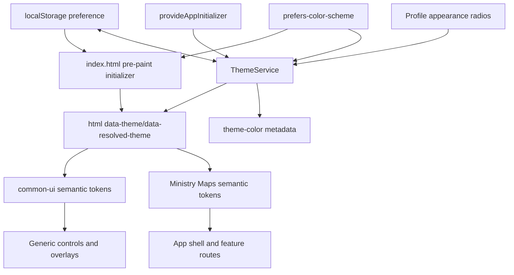

# Requirements

### Purpose and task boundary

Create a documentation-only implementation packet at `apps/ministry-maps/backlog/dark-light-mode-feature/`. The packet must be detailed enough for a low-reasoning local model to implement the feature without rediscovering architecture or product behavior. This task must not alter application, library, test, or durable product-documentation source files; those changes are specified for the later implementation.

### Confirmed product decisions

- Apply the selected appearance to the entire Ministry Maps application: signed-out authentication/onboarding pages, authenticated routes, app shell, loading/error states, CDK dialogs/overlays, menus, toasts, and shared controls.
- Put the appearance control on `/profile`.
- Offer exactly three preferences: `system`, `light`, and `dark`, displayed as `Sistema`, `Claro`, and `Escuro`.
- Follow operating-system changes live while `system` is selected.
- Persist only on the current device/browser; do not write appearance to Firestore or the user model.
- Use split semantic tokens: generic tokens belong to `libs/common-ui`, while Ministry Maps domain/status tokens remain in the app.
- Resolve and apply the preference before first paint to prevent a light-theme flash.

### Functional requirements

1. **Preference control**

   - Add an `Aparência` card/section to `ProfilePageComponent`.
   - Use a native `fieldset`/`legend` and three radio inputs, not a custom switch. The three states are mutually exclusive and keyboard operable.
   - Show concise Portuguese helper text explaining that `Sistema` tracks the device setting.
   - Apply a selection immediately; there is no separate Save action and no success toast.
   - Keep profile account details, congregation change, and logout behavior unchanged.

2. **Persistence contract**

   - Use the storage key `ministry-maps.theme-preference`.
   - Persist only the literal values `system`, `light`, or `dark`.
   - Treat a missing, malformed, or inaccessible value as `system`; never fail application startup because storage is unavailable.
   - Keep an in-memory selection when a write fails, while accepting that it will not survive reload.
   - Synchronize another same-origin tab when a valid value for this key arrives through the browser `storage` event; invalid/removed values resolve to `system`.

3. **Theme resolution**

| Stored preference          | OS preference       | Effective scheme |
| -------------------------- | ------------------- | ---------------- |
| `system` or no valid value | light/no preference | `light`          |
| `system` or no valid value | dark                | `dark`           |
| `light`                    | either              | `light`          |
| `dark`                     | either              | `dark`           |

- A `matchMedia('(prefers-color-scheme: dark)')` change updates the effective scheme immediately only when the preference is `system`.
- The root element exposes `data-theme="system|light|dark"` and `data-resolved-theme="light|dark"` for CSS, diagnostics, and E2E assertions.
- The browser `color-scheme` and `theme-color` metadata follow the effective scheme so native controls and browser chrome are coherent.

4. **First paint**

   - A minimal defensive script in `apps/ministry-maps/src/index.html`, placed before render-blocking application styles, validates local storage, evaluates the media query, and sets both root attributes before content paints.
   - CSS provides a light default when JavaScript or storage is unavailable.
   - Angular takes ownership after bootstrap without visibly changing an already-correct root state.

5. **Visual coverage**
   - Replace rendered hard-coded light colors with semantic CSS custom properties across global styles, `common-ui`, app shell/shared components, all feature routes, and overlays.
   - Preserve semantic meaning for success, warning, danger, assignment/work status, links, and disabled states; do not map every color to a generic foreground/background.
   - Use `currentColor` for SVG icons wherever the icon should inherit nearby text/action color.
   - Keep logos, territory imagery, and user-provided/content imagery unchanged unless the route audit demonstrates a contrast problem; do not apply blanket CSS inversion.

### Accessibility and quality requirements

- Target WCAG AA: at least `4.5:1` for normal text and `3:1` for large text, focus indicators, and meaningful control boundaries.
- Selection, validation, and status must not be communicated by color alone.
- Preserve visible `:focus-visible`, hover, active, selected, disabled, placeholder, autofill, and validation states in both schemes.
- Do not add a global animated color transition; switching is immediate and cannot violate reduced-motion preferences.
- Avoid CSS `dark:` utility proliferation. Central semantic CSS custom properties must be the source of theme values because the app spans Sass, Tailwind layout utilities, CDK overlays, and runtime SVG colors.
- New Angular components are standalone, new dependencies use `inject()`, new files are kebab-case, and TypeScript cross-project imports use `@kingdom-apps/common-ui`.

### Out of scope

- Firestore/user-schema changes, cross-device synchronization, backend work, and migration scripts.
- A header/nav theme toggle, scheduled themes, custom colors, or more than the three confirmed choices.
- Redesigning layouts, typography, navigation, or domain workflows.
- Unrelated migration of legacy feature-routing NgModules.
- Implementing dark mode during this documentation task.

# Backlog Artifacts

### Required location and file tree

Create `backlog` beside the existing `apps/ministry-maps/docs` directory, not inside it:

```text
apps/ministry-maps/
├── docs/
└── backlog/
    └── dark-light-mode-feature/
        ├── README.md
        ├── requirements.md
        ├── current-state-audit.md
        ├── technical-design.md
        ├── style-migration-matrix.md
        ├── implementation-runbook.md
        ├── testing-and-documentation.md
        └── assets/
            ├── theme-token-contract.md
            ├── route-component-matrix.md
            └── acceptance-checklist.md
```

All artifacts are Markdown; Mermaid diagrams stay embedded in Markdown, so no generated image or binary asset is needed.

### File responsibilities

- `README.md`

  - Entry point for the local model.
  - State `Status: Ready for implementation` and `Scope: planning only; production code unchanged`.
  - Record the confirmed decisions and non-goals.
  - Link every document in required reading/execution order.
  - Include a phase checklist and definition of done.
  - Tell the implementer to complete one phase, its focused tests, and its matrix rows before moving on.

- `requirements.md`

  - Copy the behavioral contract and acceptance criteria from the Requirements tab.
  - Assign stable IDs such as `FR-01`, `A11Y-01`, and `AC-01` so implementation and tests can cross-reference them.
  - Include the resolution truth table and Portuguese profile copy.

- `current-state-audit.md`

  - Explain the current light-only Sass palette, global styles, runtime TypeScript colors, profile composition, overlays, and test/doc locations.
  - Record concrete files and risky patterns; do not merely say “update all components.”
  - Clearly distinguish files known to render hard-coded colors from files that only require visual verification.

- `technical-design.md`

  - Contain the architecture, data flow, service API, bootstrap behavior, CSS selector strategy, token ownership, failure handling, and file-level design in the Technical Design tab.
  - Include the Mermaid architecture diagram.
  - Record rejected alternatives: Firestore persistence, app-level overrides of library internals, Tailwind-only dark classes, and Angular-only post-bootstrap application.

- `style-migration-matrix.md`

  - Provide one row per affected style/component group with columns: `ID`, `surface`, `files`, `current assumption`, `target semantic token/state`, `unit-test impact`, `E2E/manual scenario`, and `status`.
  - Seed every group named in the Migration Inventory tab; use `Not started`, `In progress`, `Blocked`, or `Done` only.

- `implementation-runbook.md`

  - Reproduce the ordered phases in the Implementation Runbook tab as checkbox-sized tasks.
  - Every task names exact files/symbols, expected end state, tests to update immediately, and a stop condition.
  - Warn the model not to perform opportunistic module, routing, or design-system refactors.

- `testing-and-documentation.md`

  - Specify unit, integration/E2E, visual/manual, accessibility, regression, and Nx validation scenarios.
  - List durable documentation updates under `apps/ministry-maps/docs` that happen with implementation, not during packet creation.
  - Provide a requirement-to-test traceability table.

- `assets/theme-token-contract.md`

  - List every generic and app token, exact light/dark seed values, intended usage, forbidden usage, contrast pairing, and migration examples.
  - Mark token names as contracts; components must not introduce unreviewed one-off theme values.

- `assets/route-component-matrix.md`

  - List each route/shell/overlay, its component directories, reachable states, required role/fixture, and light/dark/system checks.

- `assets/acceptance-checklist.md`
  - Be the final implementation gate, with checkboxes for behavior, first paint, all route groups, accessibility, tests, docs, and commands.
  - Include an evidence column for test name, screenshot/manual note, or command result.

### Artifact-writing rules

- Keep the documents cross-linked and avoid contradictory duplicate contracts; `requirements.md` owns behavior and `assets/theme-token-contract.md` owns color/token values.
- Use relative Markdown links so the packet remains portable.
- Use kebab-case names and UTF-8 Portuguese copy.
- Include “do not proceed” gates when focused tests fail.
- Do not claim implementation or validation is complete in this planning-only change.

# Technical Design

### Current implementation context

- `apps/ministry-maps/src/styles.scss` imports the shared Sass system, applies global `.radio-option` styling, and contains CDK overlay/loading rules with light-only values.
- `libs/common-ui/src/lib/styles/abstract/_variables.scss` and `variables.ts` expose primitive palettes and light-specific semantic aliases (`$text`, `$text-medium`, `$form-control-background-color`, white/grey surfaces). `base/_base.scss` fixes the body to `$white-300`; `base/_typography.scss` fixes utility text classes to dark text.
- Generic surfaces use those compile-time values in `button`, `card`, `dialog`, form controls, menus, headers, search, notes, filters, spinner, and toaster styles. Some components also import color constants in TypeScript and pass literal SVG fills.
- `apps/ministry-maps/src/app/app.component.scss` and `.html` style the shell/nav with fixed light values and a literal white icon fill. Route components repeat Sass palette values, hex colors, inline `backgroundColor`, arbitrary Tailwind backgrounds, and runtime icon color bindings.
- `apps/ministry-maps/src/index.html` has a single hard-coded `theme-color` and no pre-paint preference initialization.
- `/profile` is a standalone `ProfilePageComponent` composed of `CardComponent`, profile identity content, `ChangeCongregationComponent`, and logout. It already uses signals/`inject()` and has adjacent unit coverage plus `apps/ministry-maps/e2e/src/profile.spec.ts`.

### Architecture



### Key decisions and rationale

1. **Preference on the root, effective scheme exposed separately**

   - `data-theme` stores `system|light|dark`; `data-resolved-theme` stores `light|dark`.
   - CSS can react natively to OS changes for `data-theme='system'`, while Angular exposes effective state for metadata, tests, and any unavoidable runtime behavior.

2. **CSS custom properties over Sass theme branching**

   - Sass variables remain useful primitives at build time but cannot change at runtime.
   - Components consume semantic `var(--...)` values. Explicit hover/active tokens replace attempts to run Sass color functions on CSS variables.

3. **Split ownership**

   - Add generic `--kui-*` contracts in `libs/common-ui/src/lib/styles/base/_theme.scss`, imported by `base/_index.scss`/`styles/index.scss`.
   - Add app aliases/domain tokens in `apps/ministry-maps/src/styles/_theme.scss`, imported from `apps/ministry-maps/src/styles.scss`.
   - `common-ui` must never reference `--mm-*` tokens or Ministry Maps status concepts.
   - Consumers without any `data-theme` retain the current light default; dark behavior is opt-in through the root attribute.

4. **Progressive, flash-free startup**
   - The head initializer sets validated attributes synchronously and catches all storage/media failures.
   - CSS light defaults make failure safe.
   - `ThemeService.initialize()` is registered with Angular’s standalone `provideAppInitializer` in `app-config.ts`; it must be idempotent and adopt the same state rather than resetting it.

### Runtime contracts

Add under `apps/ministry-maps/src/app/core/theme/`:

```ts
export type ThemePreference = 'system' | 'light' | 'dark';
export type ResolvedTheme = 'light' | 'dark';

export const THEME_STORAGE_KEY = 'ministry-maps.theme-preference';
export const DARK_MODE_QUERY = '(prefers-color-scheme: dark)';

@Injectable({ providedIn: 'root' })
export class ThemeService {
  readonly preference: Signal<ThemePreference>;
  readonly resolvedTheme: Signal<ResolvedTheme>;

  initialize(): void;
  setPreference(preference: ThemePreference): void;
}
```

Suggested files are `theme.types.ts`, `theme.constants.ts`, `browser-window.token.ts`, `theme.service.ts`, and `theme.service.spec.ts`.

- `browser-window.token.ts` obtains `DOCUMENT.defaultView` through an `InjectionToken`, allowing tests to provide deterministic `localStorage`, `matchMedia`, and events. Do not directly read ambient `window` throughout components.
- `ThemeService` uses `inject(DOCUMENT)`, `inject(BROWSER_WINDOW)`, and `inject(DestroyRef)`; it validates at every external boundary.
- It keeps a preference signal and a system-dark signal, derives `resolvedTheme` with `computed`, and applies root attributes/meta through one private method or effect.
- It registers one media-query listener and one `storage` listener, removes both through `DestroyRef`, and does not write back while processing a storage event.
- `setPreference` validates the argument, updates in-memory state/root immediately, then attempts persistence in `try/catch`.
- Metadata colors are centralized constants shared by the service contract and mirrored in the tiny head initializer; a test/E2E assertion must detect drift.

### Root selector strategy

Both generic and app theme files follow the same ordering:

```scss
:root,
:root[data-theme='light'],
:root[data-theme='system'] {
  @include light-theme-tokens;
}

:root[data-theme='dark'] {
  @include dark-theme-tokens;
}

@media (prefers-color-scheme: dark) {
  :root[data-theme='system'] {
    @include dark-theme-tokens;
  }
}
```

- Set `color-scheme: light`, `dark`, or `light dark` consistently on these selectors.
- Keep the media block after light declarations so `system` dark values win by cascade.
- CDK overlays are appended under `body` but still inherit root properties; migrate `.cdk-overlay-backdrop` and dialog surfaces rather than adding a second overlay theme mechanism.

### Minimum generic token contract

The token asset must finalize and contrast-check these seed values. Existing primitive Sass variables may back the light values, but rendered properties consume the CSS variables.

| Token                           |           Light seed |                     Dark seed | Intended use                    |
| ------------------------------- | -------------------: | ----------------------------: | ------------------------------- |
| `--kui-color-canvas`            |            `#E7E6E4` |                     `#121212` | body/app background             |
| `--kui-color-surface`           |            `#F8F8F8` |                     `#1E1E1E` | cards/dialog content            |
| `--kui-color-surface-elevated`  |            `#FDFDFD` |                     `#27272A` | inputs, menus, elevated content |
| `--kui-color-surface-muted`     |            `#D1D0CE` |                     `#363332` | subdued/selected regions        |
| `--kui-color-surface-hover`     |            `#E7E6E4` |                     `#3F3F46` | neutral hover/pressed state     |
| `--kui-color-surface-inverse`   |            `#4D4947` |                     `#0F172A` | branded/inverse headers         |
| `--kui-color-text`              |    `rgba(0,0,0,.87)` |       `rgba(255,255,255,.87)` | primary text/icons              |
| `--kui-color-text-muted`        |    `rgba(0,0,0,.60)` |       `rgba(255,255,255,.68)` | secondary/caption text          |
| `--kui-color-text-disabled`     |    `rgba(0,0,0,.38)` |       `rgba(255,255,255,.38)` | disabled content only           |
| `--kui-color-on-inverse`        |            `#FDFDFD` |                     `#F8FAFC` | content on inverse surface      |
| `--kui-color-border`            |            `#BAB7B5` |                     `#525252` | standard control/divider border |
| `--kui-color-border-strong`     |            `#615D5C` |                     `#78716C` | emphasized boundaries           |
| `--kui-color-action-primary`    |            `#2A4970` |                     `#60A5FA` | primary controls                |
| `--kui-color-on-action-primary` |            `#FDFDFD` |                     `#0F172A` | primary-control content         |
| `--kui-color-link`              |            `#4171AE` |                     `#93C5FD` | links                           |
| `--kui-color-danger`            |            `#DC2727` |                     `#FCA5A5` | destructive/error content       |
| `--kui-color-success`           |            `#15803D` |                     `#86EFAC` | successful state                |
| `--kui-color-warning`           |            `#B45309` |                     `#FCD34D` | warning state                   |
| `--kui-color-focus`             |            `#2563EB` |                     `#93C5FD` | focus indicator                 |
| `--kui-color-backdrop`          |    `rgba(0,0,0,.48)` |             `rgba(0,0,0,.72)` | CDK overlay backdrop            |
| `--kui-shadow-surface`          | current `$shadow-z1` |  `0 8px 24px rgba(0,0,0,.55)` | cards/menus                     |
| `--kui-shadow-dialog`           | current `$shadow-z6` | `0 16px 40px rgba(0,0,0,.65)` | dialogs                         |

Add explicit primary hover/active, danger-surface/on-danger, success-surface/on-success, warning-surface/on-warning, placeholder, and control-autofill tokens while writing the token asset. Do not derive these with Sass functions at component call sites.

### Ministry Maps token layer

- Define `--mm-color-page`, `--mm-color-shell`, `--mm-color-shell-content`, `--mm-color-profile-avatar`, and route/domain status tokens as aliases or app-owned values.
- Give territory/work states semantic names (for example assigned, available, completed, overdue/attention) based on the existing business meaning, not palette names such as `green-500`.
- Each status requires background, foreground, border/icon, and selected/hover pairings where used.
- Preserve the current recognizable status hue when it passes contrast; adjust luminance/saturation independently per scheme when it does not.

### Planned file changes during later implementation

**Add**

- `apps/ministry-maps/src/app/core/theme/theme.types.ts`
- `apps/ministry-maps/src/app/core/theme/theme.constants.ts`
- `apps/ministry-maps/src/app/core/theme/browser-window.token.ts`
- `apps/ministry-maps/src/app/core/theme/theme.service.ts`
- `apps/ministry-maps/src/app/core/theme/theme.service.spec.ts`
- `apps/ministry-maps/src/styles/_theme.scss`
- `libs/common-ui/src/lib/styles/base/_theme.scss`
- `apps/ministry-maps/src/app/features/profile/components/appearance-settings/appearance-settings.component.ts`
- `apps/ministry-maps/src/app/features/profile/components/appearance-settings/appearance-settings.component.html`
- `apps/ministry-maps/src/app/features/profile/components/appearance-settings/appearance-settings.component.scss`
- Adjacent appearance component spec.

**Bootstrap/profile modifications**

- `apps/ministry-maps/src/index.html`
- `apps/ministry-maps/src/app/app-config.ts`
- `apps/ministry-maps/src/styles.scss`
- `apps/ministry-maps/src/app/features/profile/pages/profile-page/profile-page.component.{ts,html,scss,spec.ts}`

The exhaustive styling/test modifications are tracked in the migration matrix rather than hidden behind these representative files.

# Migration Inventory

### Migration rule set

For every matrix row:

1. Identify what the color means (canvas, surface, text, border, action, focus, semantic status), not just its current hex/Sass variable.
2. Replace the rendered value with an existing semantic custom property; add a token only when no existing semantic role fits.
3. Cover default, hover, active, focus-visible, selected, disabled, validation, placeholder/autofill, and responsive states that the component actually supports.
4. Replace presentation-only TypeScript colors with CSS classes/custom properties and `currentColor`. Keep TypeScript color values only when data or a third-party API genuinely requires a concrete runtime string.
5. Update the adjacent unit spec in the same matrix row when markup, inputs/defaults, classes, or behavior change.
6. Mark the row done only after both explicit light and explicit dark are visually checked; check `system` separately at route level.

Do not use `color.scale(var(--token), ...)`. Create explicit state tokens. Do not globally replace every white/green/red occurrence without understanding on-color and domain meaning.

### Generic `common-ui` inventory

Audit and migrate these known light-color owners:

- Global styles: `styles/base/_base.scss`, `_typography.scss`, `styles/components/_form-control.scss`, `_form-control-error.scss`, and `_menu.scss`; wire `_theme.scss` through the base/style indexes.
- Basic surfaces/actions: `components/button`, `card` (including `card-body` links and inverse `card-header`), `dialog`/`dialog-footer`, `confirm-dialog`, `floating-action-btn`, and `icon-button`.
- Forms/search: `form-field` input/select/label, `search-input`, and sort-filter text/select/toggle/dialog/container styles.
- Feedback/content: `copy-text-block`, `note`, `spinner`, and `toaster` severity variants.
- Shell-like generic component: `header`.
- Runtime color owners: `card-header.component.ts`, `copy-text-block.component.ts`, `floating-action-button.component.ts`, `header.component.ts/html`, `icon-button.component.ts`, `icon.component.ts`, `note.component.ts`, `search-input.component.ts`, `sort-filter.component.ts`, `spinner.component.ts`, and `toaster-container.component.ts` where applicable.
- `icon-button.component.ts` currently uses constructor injection and writes a literal hover custom property. If that TypeScript is modified, migrate only this component to `inject()` and make the default hover value a semantic CSS fallback; do not initiate unrelated library-wide DI migration.
- Keep primitive exports in `_variables.scss`/`variables.ts` for compatibility, but stop importing their presentation colors into newly modified app templates. Do not put Ministry Maps tokens/models in this library.

### Global shell and shared app inventory

- `apps/ministry-maps/src/styles.scss`: body/global text context, `.radio-option`, CDK backdrop, global loading surface, and any arbitrary light values.
- `app.component.scss` and `app.component.html`: shell/nav background, borders/shadow, active/inactive icon/text colors, and literal white icon binding.
- Shared components under `src/app/shared/components`: `loading`, `page-not-found`, `selection-list`, `icon-radio`, `divider`, `notes-dialog`, and `unlink-territory-dialog`.
- Shared directives/templates that pass `fillColor`, inline `style.backgroundColor`, or a palette-derived CSS custom property.
- Loading and fallback states must initialize under the correct root scheme before lazy routes render.

### Signed-out/auth route inventory

Cover the complete standalone auth flow under `src/app/core/features/auth`:

- `login-page`
- `welcome-page`
- `recover-password`
- Sign-up `choose-congregation`, `create-congregation`, and `choose-role`
- Auth forms, validation/error/help text, links, cards, logos, icon-radio options, and button states

Explicitly search these templates/styles for Sass palette imports, hex/rgb values, arbitrary Tailwind background/text colors, `fillColor`, inline color/background styles, and SVG `fill`/`stroke`. Verify browser autofill in both schemes.

### Authenticated route inventory

Seed `assets/route-component-matrix.md` with every group below, including empty/loading/error/dialog/mobile states:

- **Home**: `features/home/pages/home-page` and cards `ministry-maps-card`/`territory-card`.
- **Profile**: `features/profile/pages/profile-page`, `components/change-congregation.component`, and the new standalone `appearance-settings` component.
- **Territories**: territory page/list/list-item, work-list/work-list-item, territory notes/add-note, assign dialog, confirm-return dialog, create/update page, territory form, and unlink dialog. Replace palette-driven `--color`/inline status backgrounds with semantic status classes/tokens.
- **Work**: work page, assigned-work, work notes, work card/header/item/list, and add-note dialog.
- **Users**: users page/list/list-item, add/edit user pages, user form, user details, and congregation association UI.
- **Configuration**: configuration page; congregation page/list/list-item/form; invite page/list/list-item/associate dialog; notification configuration/component.
- **Overlays independent of route**: confirmation dialogs, sort/filter dialogs, menus, toasts, notes dialogs, CDK backdrop, and focus traps.

Feature-routing NgModules currently load several legacy routes. Styling them does not authorize converting or expanding those modules; new/modified components remain standalone according to repository rules.

### Known pattern search checklist

The matrix must record every occurrence found in affected HTML/SCSS/TS of:

- `$white-*`, `$gray-*`/`$grey-*`, `$light-grey-*`, `$text*`, `$blue-btn`, `$link*`, `$red-*`, `$green-*`, or raw palette values used for rendering.
- Hex, `rgb()`/`rgba()`, `white`, `black`, `background`, `background-color`, `color`, `border-color`, `box-shadow`, `fill`, and `stroke`.
- `[fillColor]`, `[strokeColor]`, `style.backgroundColor`, `style.color`, and CSS custom properties assigned from TypeScript.
- Tailwind arbitrary color classes such as `bg-[#...]` or `text-[#...]`.

Primitive definitions, test fixtures, and domain data are not automatically defects. Each occurrence is classified as `migrate`, `retain with reason`, or `false positive`; the final post-migration search must leave no unclassified rendered color.

# Implementation Runbook

### Phase 0 — Read, baseline, and constrain

- Read `AGENTS.md`, relevant Angular/styling/unit/E2E/monorepo/common-ui rules, `ARCHITECTURE.md`, this packet, `apps/ministry-maps/docs/developer-guide/style-guide.md`, `component-catalog.md`, `apps/ministry-maps/docs/user-guide/profile.md`, and `apps/ministry-maps/e2e/README.md`.
- Run the existing focused targets before changes and record failures separately; do not “fix” a baseline failure by weakening tests.
- Fill all `Not started` rows in the route/component matrix before editing styles.
- Stop if an implementation decision contradicts `requirements.md`; update/approve the contract instead of improvising.

### Phase 1 — Establish semantic token foundations

1. Add `libs/common-ui/src/lib/styles/base/_theme.scss` with light defaults, explicit light/dark selectors, and system media behavior; export/import it through the existing style index chain.
2. Add `apps/ministry-maps/src/styles/_theme.scss` for `--mm-*` aliases and domain tokens; import it from `styles.scss` after generic tokens and before components consume it.
3. Populate all tokens from `assets/theme-token-contract.md`, including explicit interaction and on-color pairs.
4. Change body/global typography/form-control/menu/backdrop foundations to consume tokens while preserving current light appearance.
5. Add/adjust focused `common-ui` specs only for changed public behavior or markup; verify `common-ui` test/lint before proceeding.

**Stop condition:** a no-attribute root still renders the existing light baseline, `data-theme='dark'` resolves every required token, and generic styles contain no `--mm-*` references.

### Phase 2 — Add flash-free runtime theme state

1. Add theme types/constants/window token/service and unit tests under `core/theme`.
2. Implement defensive preference validation, storage reads/writes, `matchMedia` observation, cross-tab storage observation, computed resolution, root/meta application, and listener cleanup.
3. Register idempotent `ThemeService.initialize()` with `provideAppInitializer` in `app-config.ts`; use `inject()`, never constructor injection.
4. Update `index.html` with `color-scheme` metadata, one identifiable `theme-color` meta, and a tiny pre-paint initializer. Keep its key, allowed values, resolution rule, attributes, and metadata colors synchronized with the TypeScript contract.
5. Unit-test every truth-table/failure/listener case before styling routes.

**Stop condition:** cold navigation, reload, and initialization with blocked/malformed storage produce no error and start with the correct attributes before Angular content is visible.

### Phase 3 — Migrate generic components

Work through the generic inventory in small slices: foundations/forms, actions/cards, dialogs/menus, then feedback/filter components.

- Replace Sass presentation values with semantic custom properties.
- Replace literal icon colors with `currentColor` and host semantic `color` where appropriate.
- Replace TypeScript severity/status color maps with semantic modifier classes and CSS tokens.
- Preserve public inputs unless they are solely an obsolete color escape hatch; if an input must remain for compatibility, default it to a token/currentColor and document it.
- Update each adjacent spec immediately, including any changed icon defaults/classes.
- Run `common-ui` test/lint at the end of each slice.

**Stop condition:** all generic matrix rows are done, dark overlays/forms/status feedback are legible, and current consumers without theme attributes remain light-compatible.

### Phase 4 — Migrate app shell, shared UI, and auth

1. Convert app shell/nav/global loading/shared components to `--kui-*`/`--mm-*` tokens.
2. Remove literal SVG fills in templates; use inherited color or semantic state classes.
3. Migrate signed-out login/welcome/recovery/sign-up routes, including validation, autofill, radio cards, disabled actions, and links.
4. Update adjacent unit specs for changed classes/templates.
5. Add an early E2E smoke case proving a stored dark choice affects a signed-out route before login and survives navigation.

**Stop condition:** first paint, shell, every signed-out route, loading, error, and shared dialog state pass explicit light and dark checks.

### Phase 5 — Add profile control and migrate feature routes

1. Build standalone `AppearanceSettingsComponent` using `inject(ThemeService)`, native radios, stable `data-testid` values (`profile-theme-system`, `profile-theme-light`, `profile-theme-dark`), and the confirmed Portuguese copy.
2. Import it directly into standalone `ProfilePageComponent` and place the appearance card between identity/congregation content and logout without changing existing authorization or logout behavior.
3. Add unit tests for initial checked state, all three selections, immediate service calls, helper semantics, and keyboard/native radio behavior.
4. Migrate Home, Profile, Territory, Work, Users, and Configuration rows in the route matrix. Treat territory/work status colors as domain semantics, not generic palette replacement.
5. For each feature slice, update its adjacent tests and run focused Ministry Maps tests before moving to the next slice.

**Stop condition:** every route/component row is classified and done; no route requires reload to update; explicit preferences ignore OS changes; system follows them live.

### Phase 6 — Complete E2E, accessibility, docs, and final gates

- Implement the E2E scenarios and helpers from `testing-and-documentation.md`, using storage initialization before page load and Playwright media emulation.
- Perform the route/state visual checklist at phone and desktop widths in light, dark, and representative system mode.
- Check contrast, focus, status redundancy, native controls, autofill, scrollbars, overlays, and browser metadata.
- Complete durable docs under `apps/ministry-maps/docs`; update packet status/evidence rather than rewriting historical requirements.
- Run the full required Nx checks in dependency order and resolve failures without skipping/deleting tests.
- Repeat the rendered-color search; every remaining hard-coded value must have a documented semantic reason.

**Final stop condition:** every acceptance item has evidence, all required commands pass, durable docs describe actual behavior, and no Firestore/user-model change exists.

# Testing & Documentation

### Unit test plan

#### `ThemeService`

Add deterministic tests for:

- Missing key selects `system`; light and dark media environments resolve correctly.
- Each valid stored preference is restored and reflected on both root attributes.
- Invalid value is discarded/treated as `system` without throwing.
- `setPreference` updates signals, root attributes, `color-scheme`/metadata, and storage immediately.
- Storage read and write exceptions fall back safely; a failed write still applies in memory.
- A media-query change updates `resolvedTheme`, root metadata, and `theme-color` for `system`.
- A media-query change does not override explicit `light` or `dark`.
- Valid, removed, and invalid cross-tab storage events are handled without write loops.
- Repeated `initialize()` does not duplicate listeners.
- Destroy cleanup removes media and storage listeners.
- Head initializer and Angular constants agree on key, values, attributes, and light/dark metadata colors (direct unit assertion where practical, otherwise required E2E assertions).

Use injected window/document doubles; do not mutate uncontrollable process-global browser state across tests.

#### Profile

Update `profile-page.component.spec.ts` and add an adjacent appearance component spec:

- Section heading/helper and all three labels are present.
- The service’s current signal determines the checked radio.
- Selecting each option calls `setPreference` exactly once with the corresponding literal.
- Native grouping/labels are accessible and test IDs are stable.
- Existing identity, role/congregation, congregation-change authorization, confirm-logout, and logout tests remain valid.

#### Component regressions

- Update affected `common-ui` specs when icon defaults become `currentColor`, runtime severity maps become classes, or inputs/default markup change.
- Update app specs when inline styles/color inputs become semantic classes.
- Assert semantic class/state selection, not browser-computed hex serialization, in unit tests; computed visual behavior belongs in E2E/manual checks.
- Never delete, skip, or loosen an existing behavior test merely because markup was migrated.

### E2E plan

Extend `apps/ministry-maps/e2e/src/profile.spec.ts` and add a focused theme spec/helper only if that keeps the existing suite clearer.

Create helpers that set `ministry-maps.theme-preference` with `page.addInitScript` before navigation and use `page.emulateMedia({ colorScheme: ... })`; do not set storage after the first paint when testing flash-free behavior.

Required scenarios:

1. With no stored value and dark OS emulation, first navigation has `data-theme='system'` and `data-resolved-theme='dark'` before app content is asserted.
2. While `system` is selected, changing emulation dark → light updates effective state without reload.
3. Selecting `Escuro` on profile updates the root and local storage immediately; reload and route navigation retain it.
4. Selecting `Claro` remains light under dark OS emulation.
5. Selecting `Sistema` removes the explicit override behavior and resumes live OS following.
6. Radio controls can be reached/changed by keyboard and expose checked state correctly.
7. A signed-out login/auth surface honors a stored choice before authentication.
8. A representative authenticated route from Home, Territories/Work, Users, and Configuration renders its canvas/surface/text using dark tokens; use the repository’s existing role fixtures rather than bypassing guards.
9. Open a CDK dialog/menu and a feedback surface (toast or validation error) in dark mode and assert inherited effective colors/visibility.
10. Existing profile logout and congregation-change E2E flows still pass.

Do not introduce screenshot-baseline infrastructure unless the repository already supports it. Use stable attribute/state and computed-style assertions for automation, with the route matrix for human visual evidence.

### Manual/visual and accessibility matrix

For every route group, check at phone and desktop widths:

- Default, loading, empty, populated, validation/error, disabled, selected, hover, focus-visible, and open-overlay states that are reachable.
- Light, dark, system-light, and system-dark; one live system transition while the route and an overlay are open.
- Text/background and status/on-status contrast; focus/control boundaries at `3:1` minimum.
- Native input/select/autofill/placeholder, scrollbars, overscroll canvas, browser theme color, and PWA/loading shell.
- Icons use inherited semantic colors and remain visible; logos/images are not accidentally inverted.
- No light flash on hard reload with a stored dark preference, including throttled load where practical.
- No horizontal/layout shift caused by theme changes.

### Durable documentation changes during implementation

- Update `apps/ministry-maps/docs/user-guide/profile.md` with where to find `Aparência`, what `Sistema`/`Claro`/`Escuro` mean, device-local persistence, and immediate application.
- Add `apps/ministry-maps/docs/developer-guide/theming.md` documenting root attributes, service API, storage contract, token ownership/naming, adding a new token, icon/currentColor guidance, overlay behavior, and test expectations.
- Update `apps/ministry-maps/docs/developer-guide/style-guide.md` to require semantic theme tokens instead of rendered Sass palette literals.
- Update `apps/ministry-maps/docs/developer-guide/component-catalog.md` for changed generic components and the profile appearance control.
- Link the new theming guide from `apps/ministry-maps/docs/developer-guide/README.md` and `apps/ministry-maps/docs/README.md`.
- Update `apps/ministry-maps/docs/developer-guide/architecture.md` only with the durable client-side theme boundary/data flow; do not imply backend persistence.
- Update `apps/ministry-maps/e2e/README.md` only if new shared media/storage helpers or documented invocation scope are introduced.
- Keep backlog implementation details in `backlog`; durable user/developer behavior belongs in `docs`.

### Required command gates

Use Nx through the root npm toolchain, focused first and downstream afterward:

```bash
npx nx test common-ui
npx nx lint common-ui
npx nx test ministry-maps
npx nx lint ministry-maps
npx nx build ministry-maps
npx nx typecheck-e2e ministry-maps
npx nx e2e ministry-maps
git diff --check
```

If a narrower E2E scope is desired, inspect the target help/config first rather than guessing flags; the full required target remains the final gate.

For the present documentation-only packet creation, validate relative links/commands and run `git diff --check`; do not claim the application targets passed unless they were actually run.

# Delivery Steps

### ✓ Step 1: Create the backlog scaffold and freeze the feature contract

The dark/light-mode backlog has a navigable entry point, explicit requirements, and a concrete current-state audit without changing production code.

- Create `apps/ministry-maps/backlog/dark-light-mode-feature` and its `assets` subdirectory with the exact kebab-case Markdown tree defined in the proposal.
- Write `README.md` as the local model’s ordered entry point, including status, scope guard, confirmed decisions, phase checklist, and definition of done.
- Write `requirements.md` with stable requirement/acceptance IDs, the resolution truth table, profile UX/copy, persistence/failure behavior, accessibility constraints, and non-goals.
- Write `current-state-audit.md` using the concrete global, profile, route, `common-ui`, test, and documentation files identified in the investigation.
- Cross-link the three documents and explicitly state that this change contains plans only.

### ✓ Step 2: Document the runtime architecture and exhaustive style migration map

The packet defines an implementable theme runtime/token contract and accounts for every shared, shell, auth, feature, and overlay surface.

- Write `technical-design.md` with the pre-paint initializer, standalone Angular initializer/service, signals, browser events, root attributes, metadata, failure handling, ownership boundaries, Mermaid flow, and exact planned files/APIs.
- Write `assets/theme-token-contract.md` with generic `--kui-*` and app `--mm-*` tokens, exact light/dark seed values, state/on-color pairings, usage rules, and contrast requirements.
- Write `style-migration-matrix.md` with seeded rows for global styles, all known `common-ui` color owners, app shell/shared UI, signed-out auth, each authenticated feature, and overlays.
- Write `assets/route-component-matrix.md` with route states, component directories, fixtures/roles, and light/dark/system coverage.
- Ensure the design preserves light defaults for unrelated `common-ui` consumers and forbids Ministry Maps domain concepts in the shared library.

### \* Step 3: Publish the local-model execution, testing, and documentation package

A constrained phase-by-phase runbook, traceable validation plan, and final acceptance gate are ready for a smaller model to execute later.

- Write `implementation-runbook.md` as atomic checkbox tasks with exact files/symbols, per-phase test updates, stop conditions, and anti-refactoring guardrails.
- Write `testing-and-documentation.md` with ThemeService/profile/component unit cases, Playwright media/storage flows, route/overlay checks, manual accessibility coverage, durable docs updates, and required Nx commands.
- Write `assets/acceptance-checklist.md` mapping every requirement to implementation evidence and test/manual/command evidence.
- Verify all relative links, filenames, terminology, storage literals, token names, and phase references agree across the packet.
- Run the documentation-only integrity check `git diff --check`; leave all production feature files untouched and do not mark feature acceptance items complete.
