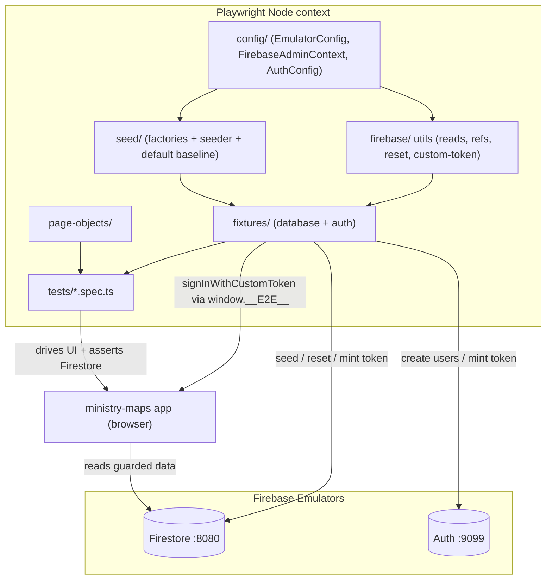

# Requirements

### Overview & Goals

Build a **strong, industry-standard E2E testing foundation** for the `ministry-maps` Angular PWA using **Playwright + Firebase Emulators + Firebase Admin SDK**. The current foundation (`apps/ministry-maps/e2e/`) already works but is loosely organized and cannot reach authenticated routes. This task **reorganizes and hardens** it into a small, composable, well-documented toolkit and proves it end-to-end with a real authenticated test on `/territories`.

Goals:
- **Composable data seeding** via Admin SDK factories with convenient, realistic defaults (Congregations, Users, Territories, Designations, Visit History).
- **Simple, composable configuration** for the emulator connection, Admin SDK context, and auth — organized as dedicated config modules instead of one monolithic `admin-sdk.ts`.
- **Well-organized Firebase utilities** (reads, references, reset, custom tokens) separated from bootstrap concerns.
- **Authenticated E2E flows** — a reusable auth fixture that establishes a real Firebase session against the Auth emulator so guarded routes can be tested.
- **A concrete proof test**: a spec that logs in and validates territories are loaded on the `/territories` route (asserting both the rendered UI and Firestore state).
- **First-class documentation** (`README.md`) that teaches developers and AI how to use the foundation correctly, referenced from `AGENTS.md` and kept in sync with `.ai/rules/frontend/e2e-testing.md`.

### Scope

**In Scope**
- Reorganize `apps/ministry-maps/e2e/` into clear layers: `config/`, `firebase/`, `seed/`, `fixtures/`, `page-objects/`, `tests/`.
- Composable config modules for the emulator, the Admin SDK context, and auth.
- Composable seed factories + a `SeedDefinition` seeder and a deterministic default baseline.
- An **authentication fixture** using the **custom-token + storageState** strategy (mint a custom token via Admin SDK, sign the browser in against the Auth emulator, reuse the session).
- A minimal, **development-only** in-app hook to allow the browser to sign in with a custom token (gated by `environment.env === 'development'`).
- `data-testid` attributes added to the territories page/list for robust selectors.
- A `territories.page.ts` page object and a `territories.spec.ts` test proving the foundation.
- Documentation: `apps/ministry-maps/e2e/README.md`, an `AGENTS.md` reference, and refreshed `.ai/rules/frontend/e2e-testing.md`.

**Out of Scope**
- CI pipeline wiring (GitHub Actions, etc.).
- Broad feature test suites beyond the territories proof test and the existing smoke checks.
- Exercising the real `signInWithPopup` OAuth flow end-to-end (the custom-token approach is used instead; the real popup remains a future add-on).
- Extracting E2E into a separate Nx project — it stays in `apps/ministry-maps/e2e/` (confirmed).

### User Stories
- As a **developer**, I want composable factory methods with sensible defaults so I can seed exactly the data a test needs in one line.
- As a **developer**, I want a reusable auth fixture so I can test guarded routes without re-implementing login in every spec.
- As an **AI agent**, I want a clear `README.md` and rules doc so I can extend the suite following the established patterns.
- As a **maintainer**, I want configuration (ports, project id, collections) in one composable place so the setup stays close to production and easy to change.

### Functional Requirements
1. Every spec imports `test`/`expect` from a single fixture entry point and automatically gets a wiped + re-seeded emulator baseline before each test.
2. `seed.factories.*` builders return fully-typed `*Seed` payloads with realistic defaults and accept `Partial` overrides.
3. `seed.write(def)` persists a `SeedDefinition` (congregations, users, territories + history, designations) with the app's real Firestore storage shape (DocumentReference links, Timestamps, history subcollection, Auth/Firestore uid parity).
4. An auth fixture exposes a way to obtain an **authenticated page** for a given role (e.g. `signInAs('admin')`), backed by a seeded user.
5. A `territories.spec.ts` signs in as an allowed role, navigates to `/territories`, and asserts the seeded territories are rendered **and** present in Firestore.
6. `README.md` documents the architecture, directory layout, config, seeding, auth, and how to run the tests, and is referenced from `AGENTS.md`.

### Non-Functional Requirements
- **No mocks** — tests run against the real emulated Firebase.
- **Deterministic & isolated** — reset + re-seed before every test (confirmed strategy).
- **kebab-case filenames**, standalone/`inject()` conventions, `@kingdom-apps/` path aliases where applicable.
- Admin SDK code runs **only** in Playwright's Node context, never in the browser.

# Technical Design

### Current Implementation

The existing foundation lives entirely in `apps/ministry-maps/e2e/` and is functional but loosely structured:
- `helpers/admin-sdk.ts` — mixes emulator constants, env wiring, Admin SDK bootstrap, collection names, **and** generic read helpers in one file.
- `helpers/reset.ts` — REST wipe of Firestore + Auth (constants imported from `admin-sdk.ts`).
- `helpers/domain/*.helper.ts` (+ `index.ts`) — `DocumentReference` builders.
- `helpers/seed/` — `types.ts`, `seeder.ts`, `default.seed.ts`, `factories/*` (congregation, user, territory, designation, visit-history).
- `fixtures/database.fixture.ts` — `resetAndSeed` (auto), `seed`, `db` fixtures.
- `tests/smoke.spec.ts`, `example.spec.ts`.
- `playwright.config.ts` (`testDir: './e2e'`, `webServer` runs `firebase emulators:exec "nx serve ministry-maps"`).

Key app facts discovered:
- `/territories` is guarded by `authGuard` (`app-routes.ts`) with `TERRITORY_ALLOWED_ROLES = [ORGANIZER, ADMIN, ELDER, SUPERINTENDENT]`; unauthenticated users are redirected to `/login`.
- Auth uses `signInWithPopup` (`firebase-auth-datasource.service.ts`); the app connects to the Auth emulator (`app.config.ts`, `connectAuthEmulator(... :9099)`) only when `environment.env === 'development' && !environment.useCloud`.
- The app keys `users/{uid}` by the Firebase Auth uid and reads the current user via `authState` (the seeder already creates matching Auth users).
- Emulator ports (`firebase.json`): Firestore `8080`, Auth `9099`, Functions `5001`.
- `firebase-admin@^13`, `@playwright/test@1.60`, `@nx/playwright@^22` are already installed.
- The territories page (`territories-page.component.html`) renders `<h2>Territórios</h2>` and a list of `kingdom-apps-territory-list-item` elements — currently **no** `data-testid` hooks.

### Key Decisions

1. **Auth strategy = custom-token + storageState (confirmed).** Admin SDK mints a custom token (`auth.createCustomToken(uid)`) for a seeded user; the browser signs in against the Auth emulator via `signInWithCustomToken`, and the resulting session is captured as Playwright `storageState` (with IndexedDB, supported in Playwright 1.60) and handed to the test as an authenticated page. This exercises the **real** Firebase Auth + real route guard without the brittleness of driving the OAuth popup.
2. **Development-only in-app auth hook.** To call `signInWithCustomToken` in the browser we need the app's `Auth` instance. We expose it on `window` **only** in the existing `provideAuth` factory branch that already runs for `environment.env === 'development' && !environment.useCloud` (the same branch that calls `connectAuthEmulator`). Production builds are unaffected. This is the minimal, well-contained app change.
3. **Session is established per test, after reset+seed.** Because the confirmed isolation strategy wipes Auth before each test (which revokes prior tokens), the auth fixture mints the custom token and signs in **after** `resetAndSeed` for that test, then reuses the resulting `storageState` within the same test's context. (Cross-test session reuse would require excluding baseline users from the reset — documented as a future optimization, not implemented now.)
4. **Keep location = `apps/ministry-maps/e2e/` (confirmed).** No new Nx project; the auto-inferred `nx e2e ministry-maps` target and existing `playwright.config.ts` remain the entry points.
5. **Split the monolithic `admin-sdk.ts` into composable modules** — `config/` (connection + contexts) vs `firebase/` (utilities) vs `seed/` (data) vs `fixtures/` (Playwright wiring). This is the core reorganization the user asked for.

### Proposed Changes

**New `config/` layer (composable configuration)**
- `config/emulator.config.ts` — a single `EMULATOR_CONFIG` (project id, Firestore/Auth/Functions host+port, derived emulator host strings, and REST clear URLs). One source of truth, aligned with `firebase.json`.
- `config/firebase-admin.context.ts` — a `FirebaseAdminContext` (class or factory) that: sets `FIRESTORE_EMULATOR_HOST`/`FIREBASE_AUTH_EMULATOR_HOST` from `EMULATOR_CONFIG`, initializes the Admin app once, applies `ignoreUndefinedProperties`, and exposes `firestore`, `auth`, and `Collections`.
- `config/auth.config.ts` — an `AUTH_CONFIG` mapping test roles to seeded uids (referencing `DEFAULT_SEED_IDS`), the default password, and the `storageState` output directory.

**New `firebase/` utility layer**
- `firebase/firestore-read.util.ts` — generic reads: `getDoc`, `getDocSnapshot`, `getCollectionDocs`, `getSubcollectionDocs`, plus a small `queryWhere` helper.
- `firebase/refs.util.ts` — consolidated `congregationRef`, `userRef`, `territoryRef`, `territoryHistoryRef`, `designationRef` (replaces `helpers/domain/`).
- `firebase/reset.util.ts` — `clearFirestore`, `clearAuth`, `resetEmulators` using `EMULATOR_CONFIG` REST URLs.
- `firebase/custom-token.util.ts` — `mintCustomToken(uid)` via the Admin `auth`.

**`seed/` layer (composable factories)**
- Move `helpers/seed/*` → `seed/*`: `types.ts`, `seeder.ts`, `default.seed.ts`, and `factories/` with `buildCongregation`, `buildUser`, `buildTerritory`, `buildVisitHistory`, `buildDesignation`, `buildDesignationTerritory` (+ barrel `index.ts`). Keep realistic Brazilian defaults; ensure every builder composes cleanly with `Partial` overrides and stable helpers for linking `congregationId`.

**`fixtures/` layer**
- `fixtures/database.fixture.ts` — `resetAndSeed` (auto), `seed` (`SeedApi`), `db` (`DbApi`) rebuilt on top of the new `config/` + `firebase/` modules.
- `fixtures/auth.fixture.ts` — extends the database fixture; exposes `signInAs(role)` → authenticated `Page` (mints token, drives the in-app hook, captures/returns `storageState`). Optionally supports `test.use({ role })`.
- `fixtures/index.ts` — exports the composed `test` + `expect` used by all specs.

**`page-objects/` layer**
- `page-objects/base.page.ts` — shared navigation/util base.
- `page-objects/territories.page.ts` — `goto()`, `heading`, `territoryItems` locator, `count()`, `addresses()` using new `data-testid`s.

**App changes (minimal, dev-gated)**
- `app.config.ts` `provideAuth` factory: inside the existing `development && !useCloud` branch, attach `window.__E2E__ = { auth, signInWithCustomToken }`.
- `territories-page.component.html`: add `data-testid="territories-heading"` and `data-testid="territories-list"`.
- `territory-list-item.component.ts`: add `data-testid="territory-list-item"` (and expose the address for assertions).

**Docs**
- `apps/ministry-maps/e2e/README.md` (new) — full usage guide.
- `AGENTS.md` — add a reference to the E2E README under the Frontend rules index.
- `.ai/rules/frontend/e2e-testing.md` — update the directory map, add the auth fixture + config-layer sections.

### Data Models / Contracts

```ts
// config/emulator.config.ts
export const EMULATOR_CONFIG = {
  projectId: 'du-ministry-maps',
  firestore: { host: '127.0.0.1', port: 8080 },
  auth: { host: '127.0.0.1', port: 9099 },
} as const;

// firebase/custom-token.util.ts
export function mintCustomToken(uid: string): Promise<string>;

// fixtures/auth.fixture.ts
export type TestRole = 'admin' | 'publisher';
export interface AuthApi {
  signInAs(role: TestRole): Promise<import('@playwright/test').Page>;
}

// in-app dev hook (app.config.ts, development only)
declare global {
  interface Window {
    __E2E__?: {
      auth: import('@angular/fire/auth').Auth;
      signInWithCustomToken: typeof import('@angular/fire/auth').signInWithCustomToken;
    };
  }
}
```

Sign-in flow inside the fixture (per test, after seed):
```ts
const token = await mintCustomToken(AUTH_CONFIG.roleUid(role));
await page.goto('/login');
await page.waitForFunction(() => !!window.__E2E__);
await page.evaluate((t) => window.__E2E__!.signInWithCustomToken(window.__E2E__!.auth, t), token);
// wait for authState to settle, then navigate to a guarded route
```

### File Structure

```
apps/ministry-maps/e2e/
├── README.md                         # NEW: usage guide
├── config/
│   ├── emulator.config.ts            # NEW: ports, project id, REST URLs
│   ├── firebase-admin.context.ts     # NEW: Admin SDK bootstrap + firestore/auth/collections
│   └── auth.config.ts                # NEW: role→uid map, default password, storageState dir
├── firebase/
│   ├── firestore-read.util.ts        # from admin-sdk.ts read helpers
│   ├── refs.util.ts                  # from helpers/domain/*
│   ├── reset.util.ts                 # from helpers/reset.ts
│   └── custom-token.util.ts          # NEW
├── seed/
│   ├── types.ts  seeder.ts  default.seed.ts
│   └── factories/ (…+ index.ts)
├── fixtures/
│   ├── database.fixture.ts           # reset+seed, seed, db
│   ├── auth.fixture.ts               # NEW: signInAs(role)
│   └── index.ts                      # composed test/expect
├── page-objects/
│   ├── base.page.ts                  # NEW
│   └── territories.page.ts           # NEW
└── tests/
    ├── smoke.spec.ts                 # refactored to new imports
    └── territories.spec.ts           # NEW: the proof test
```
(Removed: `helpers/admin-sdk.ts`, `helpers/reset.ts`, `helpers/domain/`, `example.spec.ts`.)

### Architecture Diagram



### Risks
- **Token invalidation vs reset:** wiping Auth before each test revokes tokens, so sign-in must happen after seed, per test. Mitigation: the auth fixture depends on `resetAndSeed` ordering; documented clearly.
- **In-app hook leakage:** the `window.__E2E__` hook must be strictly gated to the dev/emulator branch so it never ships to production. Mitigation: reuse the exact existing `environment.env === 'development' && !environment.useCloud` guard.
- **IndexedDB storageState fidelity:** Firebase persists auth in IndexedDB; capturing/restoring must include IndexedDB. Mitigation: Playwright 1.60 supports it; if flaky, fall back to re-signing per context (no cross-test reuse).
- **Selector brittleness:** relying on Portuguese text is fragile. Mitigation: add `data-testid`s to the territories page/list.

# Testing

### Validation Approach
Prove the foundation with a real authenticated flow and direct Firestore assertions — no mocks. All specs import `test`/`expect` from `fixtures/index.ts`, so each test starts from the wiped + re-seeded baseline. The territories spec is the acceptance test for the whole task.

### Key Scenarios
1. **Territories load on `/territories` (the proof test):**
   - `signInAs('admin')` (seeded ADMIN user, an allowed role).
   - Navigate to `/territories` via the `TerritoriesPage` page object.
   - Assert the heading `data-testid="territories-heading"` is visible (not redirected to `/login`).
   - Assert the rendered territory items count equals the 3 default-seed territories, and that seeded addresses appear.
   - Assert Firestore state via `db.getCollectionDocs(db.collections.territories)` also has 3 — UI and backend agree.
2. **On-demand seeding reflects in the UI:** seed one extra territory with a factory, reload `/territories`, assert the list now shows 4.
3. **Baseline integrity (retained smoke checks):** default baseline creates 1 congregation, 4 users, 3 territories, 1 designation; users link congregation by `DocumentReference`; dates persist as `Timestamp`; history subcollection populated; matching Auth users keyed by uid.

### Edge Cases
- **Unauthenticated access** to `/territories` redirects to `/login` (negative check that the guard is real).
- **Auth session established after reset:** verify sign-in works even though Auth was wiped immediately before (ordering correctness).
- **Idempotent reset** on an already-empty emulator does not throw.

### Test Changes
- **Add** `tests/territories.spec.ts` (auth + territories proof) using `TerritoriesPage`.
- **Refactor** `tests/smoke.spec.ts` to import from `fixtures/index.ts` and the new module paths.
- **Remove** `example.spec.ts` (superseded by smoke/territories).
- Run locally with `npx nx e2e ministry-maps` (boots emulators + serve via `webServer`); browsers via `npx playwright install chromium`.

# Delivery Steps

###   Step 1: Establish composable config + Firebase utility layers
The E2E toolkit has a clean `config/` and `firebase/` foundation replacing the monolithic `helpers/admin-sdk.ts`.

- Add `config/emulator.config.ts` with a single `EMULATOR_CONFIG` (project id, Firestore/Auth/Functions host+port, derived emulator host strings and REST clear URLs) aligned with `firebase.json`.
- Add `config/firebase-admin.context.ts` that wires the emulator env vars, initializes the Admin app once, applies `ignoreUndefinedProperties`, and exposes `firestore`, `auth`, and `Collections`.
- Add `firebase/firestore-read.util.ts` (`getDoc`, `getDocSnapshot`, `getCollectionDocs`, `getSubcollectionDocs`, `queryWhere`), `firebase/refs.util.ts` (congregation/user/territory/territory-history/designation refs, replacing `helpers/domain/`), `firebase/reset.util.ts` (`clearFirestore`/`clearAuth`/`resetEmulators`), and `firebase/custom-token.util.ts` (`mintCustomToken`).
- Remove the now-obsolete `helpers/admin-sdk.ts`, `helpers/reset.ts`, and `helpers/domain/`.

###   Step 2: Consolidate composable seed factories and seeder
Data seeding is a self-contained `seed/` module with composable factories and a deterministic baseline.

- Move `helpers/seed/*` into `seed/` (`types.ts`, `seeder.ts`, `default.seed.ts`, `factories/` + barrel) and repoint imports to the new `config/`+`firebase/` layers.
- Ensure `buildCongregation`, `buildUser`, `buildTerritory`, `buildVisitHistory`, `buildDesignation`, `buildDesignationTerritory` all provide realistic Brazilian defaults and compose cleanly via `Partial` overrides and `congregationId` linking.
- Keep the seeder's Firestore contract intact: `User.congregation` as `DocumentReference`, Auth/Firestore uid parity, `Date`→`Timestamp`, and territory `history` written to the `history` subcollection with `recentHistory`/`lastVisit` derived on the parent.
- Rebuild `fixtures/database.fixture.ts` (auto `resetAndSeed`, `seed`, `db`) on top of the new modules and add `fixtures/index.ts` exporting the composed `test`/`expect`.

###   Step 3: Implement the authentication foundation
Guarded routes can be tested via a reusable auth fixture backed by a real Firebase Auth emulator session.

- Add a development-only hook in `apps/ministry-maps/src/app/app.config.ts` `provideAuth` factory (inside the existing `environment.env === 'development' && !environment.useCloud` branch) that attaches `window.__E2E__ = { auth, signInWithCustomToken }`.
- Add `config/auth.config.ts` (`AUTH_CONFIG`: role→seeded-uid map referencing `DEFAULT_SEED_IDS`, default password, storageState directory).
- Add `fixtures/auth.fixture.ts` exposing `signInAs(role)`: mint a custom token (`mintCustomToken`), navigate to `/login`, wait for `window.__E2E__`, call `signInWithCustomToken`, wait for auth state to settle, and return an authenticated `Page` (capturing `storageState` incl. IndexedDB); ensure it runs after `resetAndSeed`.
- Compose the auth fixture into `fixtures/index.ts` so specs get both `db`/`seed` and `signInAs`.

###   Step 4: Build the territories page object and proof spec
A `territories.spec.ts` proves the foundation by logging in and validating territories load on `/territories`.

- Add `data-testid` hooks: `territories-heading` and `territories-list` in `territories-page.component.html`, and `territory-list-item` in `territory-list-item.component.ts`.
- Add `page-objects/base.page.ts` and `page-objects/territories.page.ts` (`goto()`, `heading`, `territoryItems` locator, `count()`, `addresses()`).
- Add `tests/territories.spec.ts`: `signInAs('admin')`, open `/territories`, assert the heading is visible and the 3 seeded territories render (and appear by address), and cross-check `db.getCollectionDocs(collections.territories)` returns 3; add an on-demand seed case (seed +1 territory → list shows 4) and a negative case (unauthenticated → redirected to `/login`).
- Refactor `tests/smoke.spec.ts` to the new imports and remove `example.spec.ts`.

###   Step 5: Author documentation and wire references
Developers and AI have an authoritative guide for using and extending the E2E foundation.

- Add `apps/ministry-maps/e2e/README.md` covering: architecture overview, directory map (`config/`, `firebase/`, `seed/`, `fixtures/`, `page-objects/`, `tests/`), how to run (`npx nx e2e ministry-maps`, `npx playwright install chromium`), the reset+seed model, factory/seed usage examples, the `db`/`seed`/`signInAs` fixtures, the custom-token auth strategy and the dev-only `window.__E2E__` hook, and the Firestore storage contract.
- Add a reference to the E2E README in `AGENTS.md` under the Frontend rules index.
- Update `.ai/rules/frontend/e2e-testing.md` to reflect the new directory layout, the config layer, and the auth fixture, and move authenticated flows out of the "Out of Scope" section.