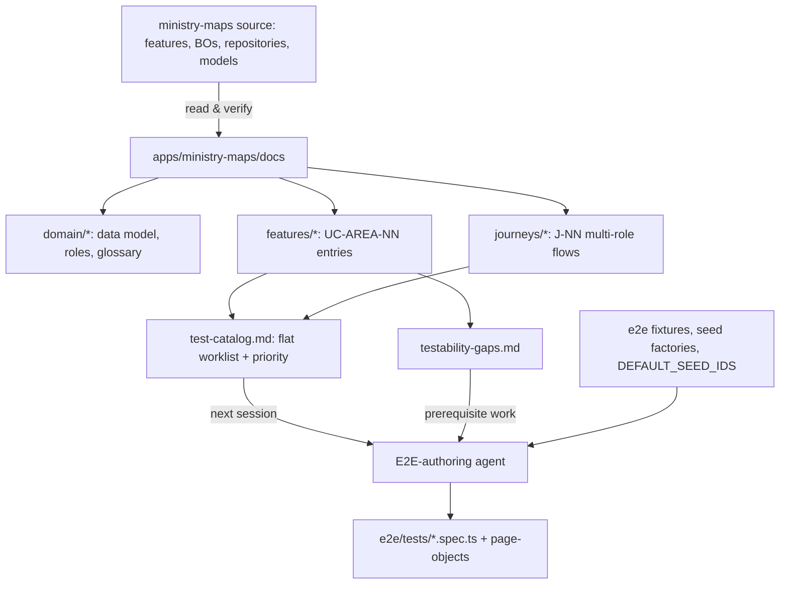

# Requirements

### Overview & Goals

Produce a **documentation artifact** (not tests) under `apps/ministry-maps/docs/` that maps **every real use case and user journey** of Ministry Maps in functional/behavioural terms, precise enough that a *different agent in a future session* can turn each entry directly into a Playwright + Firebase-emulator E2E spec without re-discovering the codebase.

Two complementary outputs:

1. **A "second brain"** — domain/data-model + roles/permissions reference (collections, invariants, storage contract, enum wire values, role matrix).
2. **A use-case & journey catalog** — per feature, every behaviour a Publisher / Organizer / Elder / Admin / App-Admin actually performs, including the *non-obvious* and *negative* paths, plus cross-feature multi-role journeys.

### Scope

**In Scope**
- `apps/ministry-maps/docs/` (new): domain reference, per-feature use-case catalogs, journeys, flat test-catalog index, testability-gap list.
- Feature areas to be mapped exhaustively:
  - **Auth & onboarding** — `/login`, `/sign-in/:inviteId`, `/welcome`, `/no-account`, guard + role redirects, logout.
  - **Territories (create/maintain)** — `/territories`: list, city filter, search, sort/filter dialog (+ localStorage persistence), drag-and-drop reorder, create/edit dialog, delete, alert badges, visit-history dialog, "moved" alert resolution, CSV export.
  - **Assignment** — `/territories/assign`: selection, expiry, designation creation, share link.
  - **Work / receive designation** — `/work/:id`: complete visit, edit last visit, undo visit, maps link, history button, expired/blocked designation.
  - **Statistics** — `/territories/statistics`: static + per-period metrics, city scoping.
  - **Users & invites** — `/users`: list ordering, edit user, delete user, invite-link creation/copy/share.
  - **Profile** — `/profile`: identity card, role badge, congregation switch (App-Admin/Superintendent), logout.
  - **Configuration** — `/configuration`: congregation city add/rename/delete + cascade to territories.
  - **Navigation shell** — role-gated menu/nav entry points.
- For each use case: actor, route, seed preconditions, steps, expected UI (pt-BR strings), **expected Firestore persistence**, edge/negative variants, priority, testability notes.
- Cross-feature **journeys** spanning multiple roles and pages (the ones named in the task plus additional realistic ones).
- A **testability-gaps** list (missing `data-testid`s, native `confirm()`, `window.open`, file download, OAuth popup) so the future agent knows what app-side hooks it must add first.

**Out of Scope**
- Writing or modifying any `*.spec.ts` (E2E or unit) — no test code in this task.
- Changing application source code (including adding `data-testid` attributes) — gaps are *documented*, not fixed.
- Fixing the defects discovered during mapping — they are recorded as "current behaviour + suspected defect" so tests assert reality, not intent.
- CI wiring, new fixtures/factories, page objects.

### User Stories

- As the **E2E-authoring agent**, I want a numbered catalog of use cases with seed preconditions and Firestore assertions, so I can write specs mechanically without reading feature code.
- As the **E2E-authoring agent**, I want multi-role journeys written as ordered steps with hand-off points, so I can build long-running specs that switch identities.
- As a **maintainer**, I want a single domain reference explaining collections, `history` vs `recentHistory`, `positionIndex`, `DocumentReference` fields and enum wire values, so seeds are always realistic.
- As a **product owner**, I want the catalog to expose behaviour that currently looks wrong (e.g. alerts hidden when a territory has no note), so we can decide whether to lock it in or fix it.

### Functional Requirements

1. Every documented use case has a stable ID (`UC-<AREA>-NN`) and every journey (`J-NN`); IDs are unique workspace-wide and never renumbered.
2. Each use case states **preconditions as seed instructions** using the existing harness vocabulary (`buildTerritory`, `buildDesignation`, `DEFAULT_SEED_IDS`, `seed.write`, `signInAs('admin' | 'publisher')`).
3. Each use case states at least one **backend assertion** (`db.getDoc`, `db.getSubcollectionDocs`, `db.queryWhere`) — not only DOM expectations — matching the project's "no mocks, assert real Firestore" philosophy.
4. Negative/edge cases are first-class entries, explicitly including: assign page with **zero** territories (must not crash and must not allow assigning), a designation territory with **no history** (history button must be absent), expired designation blocking, invalid/consumed invite link, wrong-email invite, empty congregation statistics, orphaned city after deletion, unauthenticated access to each route.
5. Journeys reference the UC IDs they compose and define the identity switch points (Admin → link → Publisher → Elder verification).
6. A flat `test-catalog.md` table lists every UC/J with area, priority (P0/P1/P2), suggested spec file name, and blocking testability gaps — usable as the future agent's worklist.
7. Documented UI strings are quoted verbatim in pt-BR; prose is in English (matching `.ai/rules` and `e2e/README.md`).
8. Every behavioural claim is traceable: each feature doc lists the source files it was derived from.

### Non-Functional Requirements

- Docs are Markdown only, no build step, no new dependencies.
- Files stay navigable (one feature per file, ~200–400 lines); a `README.md` index links everything.
- Wording is implementation-truthful: where behaviour is surprising, the doc says "current behaviour (verified in `<file>`)" and flags a suspected defect instead of describing ideal behaviour.

# Technical Design

### Current Implementation

**App under test** — Angular standalone app `apps/ministry-maps`, feature-sliced:
- `features/territory/` — `pages/territories-page`, `pages/statistics-territories-page`, assign page, `components/territory-list-item`, `territory-manage-dialog`, alert/move dialogs; BOs `bo/territory/territory.bo.ts`, `bo/territory-alerts/territory-alerts.bo.ts`, `bo/territory-statistics/territory-statistics.bo.ts`, `bo/territory-csv-exporter/territory-csv-exporter.bo.ts`; provided via `territory.module.ts`.
- `features/work/` — `pages/work-page`, `components/work-item`, `components/work-item-complete-dialog`, `bo/work.bo.ts`.
- `features/users/`, `features/profile/`, `features/configuration/`, `core/features/auth/` (+ `guards/auth.guard.ts`, `services/auth.service.ts`).
- Shared: `shared/utils/territories-filter-pipe.ts` (city/search/sort/filters), `shared/business-objects/configuration.bo.ts` (city rename cascade), `state/user.state.service.ts`, `repositories/**` with `repositories/firebase/firebase-*-datasource.service.ts`.
- Models in `apps/ministry-maps/src/models/**` (`territory.ts`, `designation.ts`, `user.ts`, `congregation.ts`, `invitation-link.ts`, `territory-visit-history.ts`, `enums/*`).

**Existing E2E foundation** (to be *referenced*, not changed) — `apps/ministry-maps/e2e/`: `fixtures/index.ts` (auto `resetAndSeed`, `seed`, `db`, `signInAs`, `authenticatedPage`), `seed/default.seed.ts` (`DEFAULT_SEED_IDS`: 1 congregation, ADMIN + 3 PUBLISHERs, 3 territories, 1 designation), `seed/factories/*`, `page-objects/territories.page.ts`, `tests/{smoke,territories}.spec.ts`, `README.md`, plus `.ai/rules/frontend/e2e-testing.md`. Only 4 `data-testid`s exist today (`territories-heading`, `territories-list`, `territories-city-filter`, `territory-list-item`).

**There is no `docs/` directory in `apps/ministry-maps` yet** — this task creates it.

### Key Decisions

1. **Docs live at `apps/ministry-maps/docs/`** (app-scoped, as the task requests), not at repo root — the artifact is Ministry-Maps-specific; `e2e/README.md` and `.ai/rules/frontend/e2e-testing.md` get pointer links so agents discover it.
2. **One file per feature area + separate journeys directory**, instead of a single mega-file — keeps each file loadable in one context window for the future agent.
3. **Fixed, greppable ID scheme** (`UC-<AREA>-NN`, `J-NN`) plus a flat `test-catalog.md` index — lets the implementing agent claim work incrementally and lets specs reference IDs in `test()` titles.
4. **Use-case template carries seed + persistence assertions in harness vocabulary** (`seed.factories.*`, `DEFAULT_SEED_IDS`, `db.*`, `signInAs`) — the doc is directly translatable to a spec with zero design decisions left over.
5. **Document current behaviour, flag defects separately.** Where code deviates from intent (see Risks) the doc records the verified behaviour, marks it `⚠ suspected defect`, and states which assertion a test should make today.
6. **Testability gaps are a deliverable, not a blocker.** Missing selectors / `confirm()` / `window.open` / download / OAuth-popup constraints are listed per use case and aggregated in `testability-gaps.md`, so a follow-up task can add `data-testid`s before specs are written.
7. **Prose in English, UI strings verbatim pt-BR** — consistent with existing rules docs and required for locale-accurate selectors.

### Proposed Changes — File Structure

```
apps/ministry-maps/docs/
├── README.md                          # index, how to use, ID scheme, doc conventions
├── domain/
│   ├── data-model.md                  # collections, models, invariants, storage contract
│   ├── roles-and-permissions.md       # RoleEnum, guard behaviour, role→feature matrix
│   └── glossary.md                    # pt-BR ↔ EN domain terms + UI label dictionary
├── features/
│   ├── auth-onboarding.md             # UC-AUTH-*
│   ├── navigation-shell.md            # UC-NAV-*
│   ├── territories-management.md      # UC-TERR-*
│   ├── territories-assign.md          # UC-ASSIGN-*
│   ├── territories-statistics.md      # UC-STAT-*
│   ├── work-designations.md           # UC-WORK-*
│   ├── users-invites.md               # UC-USERS-*
│   ├── profile.md                     # UC-PROF-*
│   └── configuration-cities.md        # UC-CFG-*
├── journeys/
│   ├── README.md                      # journey index + identity-switch conventions
│   ├── j-01-admin-creates-assigns-publisher-works.md
│   ├── j-02-visit-feedback-loop-to-elder.md
│   ├── j-03-invite-onboarding.md
│   ├── j-04-moved-alert-resolution.md
│   ├── j-05-city-rename-cascade.md
│   ├── j-06-expired-designation.md
│   └── j-07-statistics-reconciliation.md
├── test-catalog.md                    # flat table: ID | area | priority | spec file | gaps
└── testability-gaps.md               # missing testids, confirm(), window.open, downloads, OAuth
```

Docs-only change set; the single edits outside `docs/` are pointer lines added to `apps/ministry-maps/e2e/README.md` and `.ai/rules/frontend/e2e-testing.md`.

### Data Models / Contracts to capture in `domain/data-model.md`

- **Collections**: `congregations`, `users`, `territories` (+ `territories/{id}/history` subcollection), `designations`, `invitation-links`.
- **`Territory`**: `city`, `address`, `note`, `mapsLink?`, `icon` (`TerritoryIcon` = `m|w|c|cp|o`), `isBibleStudent?`/`bibleInstructor?`, `peopleQuantity?`, `positionIndex?`, `lastVisit?`, `recentHistory?`.
- **Dual history contract**: full log in the `history` subcollection; `update()` derives `recentHistory` = last **5** entries sorted ascending by date; statistics read the subcollection (`getHistory: true`) while alerts/badges read `recentHistory` only.
- **`positionIndex` is per city**, allocated by `getNextPositionIndexForCity()` (max + 1) and rewritten by drag-and-drop reorder.
- **`Designation`**: `territories: DesignationTerritory[]` is an **embedded snapshot** (`Omit<Territory,'recentHistory'> & { status }`) — it does *not* follow later edits/deletes of the source territory; `createdAt`, `expiresAt`, `settings.shouldDesignationBlockAfterExpired`.
- **`User.congregation` is a `DocumentReference`** to `/congregations/{id}`; Firestore doc id === Auth uid.
- **Wire values that matter for seeds/assertions**: `VisitOutcomeEnum` is **numeric** (`SPOKE=0`, `NOT_ANSWERED=1`, `MOVED=2`, `ASKED_TO_NOT_VISIT_AGAIN=3`, `REVISIT=4`); `DesignationStatusEnum` is `'PENDING' | 'DONE'`; `RoleEnum` strings + `getTranslatedRole()` labels (`Publicador`, `Organizador`, `Ancião`, `Admin`, `Superintendente`, `App Admin.`).
- **`CongregationSettings`**: `designationAccessExpiryDays`, `shouldDesignationBlockAfterExpired`.
- **Realtime vs one-shot reads**: territory/user lists use `collectionData` (live), designation `docData` (live), history/statistics use `getDocs` (one-shot) — determines whether a UI updates without reload.

### Use-case entry template (used verbatim in every feature doc)

```markdown
#### UC-WORK-03 — Publisher completes a visit accepting a revisit
- **Actor:** Publisher holding the designation link (no auth required)
- **Route:** `/work/:designationId`
- **Preconditions (seed):** default baseline; `buildDesignation({ expiresAt: <future>, territories: [buildDesignationTerritory({ status: PENDING })] })`
- **Steps:** 1. open link → 2. tick the item checkbox → 3. choose "Morador contatado" → 4. tick "Aceitou revisita" → 5. leave "Seu Nome" empty → 6. observe submit disabled → 7. fill name → 8. "Concluir"
- **Expected UI:** name label shows `*`; "Por favor, coloque o seu nome"; after submit the row shows the eraser (undo) affordance
- **Expected persistence:** `designations/{id}.territories[0].status === 'DONE'`; `territories/{tid}/history/{visitId}` created with `isRevisit: true`, `visitOutcome: 0`; parent `lastVisit` bumped and `recentHistory` contains the entry
- **Edge cases:** cancel keeps `PENDING`; undo removes the history entry
- **Priority:** P0 · **Gaps:** needs `data-testid` on work-item checkbox + outcome radios
```

### Architecture Diagram — how the artifact is consumed



### Risks

- **Documenting intent instead of reality.** Mitigation: every entry cites the source file it was verified against; surprising behaviour is marked `⚠ suspected defect` with the assertion a test should make **today**. Already-identified items to capture: alert badges render only when a territory has a `note`; the user-edit dialog form is disabled for every user unless the editor is `APP_ADMIN` (always-truthy condition) while "Salvar" still submits; deleting a city removes it from `congregation.cities` but leaves territories pointing at the removed city; `UserStateService` is not refreshed after a city save (needs reload); user deletion removes the Firestore doc but the `deleteUser` callable observable is never subscribed, so the Auth user survives; `authGuard` early-returns `true` for `roles: ['*']` routes *before* the login check, so `/profile`, `/configuration` and `/work/:id` render for anonymous visitors.
- **Scope explosion.** Mitigation: priorities (P0 = core revenue/behaviour path, P1 = important variants, P2 = cosmetic/rare) and a hard per-feature ordering so P0s are always documented first.
- **Untestable flows.** `signInWithPopup` OAuth, WhatsApp share (`window.open`), Google Maps deep link, native `confirm()` in the cities screen, and CSV download are called out with the Playwright technique to use (route interception, `page.on('dialog')`, `waitForEvent('download')`) or marked *manual-only*.
- **Drift.** Mitigation: `docs/README.md` states the docs are derived artifacts and lists the source paths per feature so they can be re-verified after refactors.

# Coverage Map

### Feature areas → use-case groups (target inventory)

 Area | ID prefix | Use cases to be documented (indicative, exhaustive in the docs) |
---|---|---|
 Auth & onboarding | `UC-AUTH` | login screen render; provider sign-in success → role-based landing (`/welcome` for PUBLISHER, home otherwise); unknown user → `/no-account` (+ auth user cleanup); guard redirect for each protected route while anonymous; `roles: ['*']` routes reachable anonymously (documented current behaviour); logout confirm → `/login`; forced logout on auth-state loss; invite `/sign-in/:id` valid / missing / already-consumed (`INVALID_LINK`) / wrong email (`INVALID_EMAIL`); invite consumption marks `isValid: false`, `usedAt`, `usedBy` |
 Navigation shell | `UC-NAV` | role-gated menu/nav entries per `RoleEnum`; publisher sees no admin destinations; deep-link to a forbidden route; 404/unknown route |
 Territories | `UC-TERR` | list renders congregation territories only; city select + "Todas" (cross-city sort by city); search over address+note (multi-word AND); sort by saved index vs last visit; filter dialog toggles (include bible students / include moved / icon) with badge count and localStorage persistence across reload; create territory (validation, city prefill, `positionIndex` allocation, bible-student → instructor field); edit territory; delete with confirm; drag-and-drop reorder persists `positionIndex`; alert badges (bible student, recently moved, unresolved not-answered) incl. the note-dependency defect; open history dialog vs absent when no history; "moved" alert resolution dialog outcomes; maps link button; CSV export download (`;`-separated, BOM, `mm-territorios-*.csv`); empty state / empty congregation |
 Assign | `UC-ASSIGN` | page with **zero** territories → no crash, assigning not possible; select territories across cities; expiry derived from `designationAccessExpiryDays`; create designation → `designations` doc with embedded snapshot + `PENDING` statuses + `createdBy`; generated `/work/:id` share link and copy/share affordance; creating two designations from overlapping territory sets; large selections vs Firestore `in`-query limits; anonymous/insufficient-role access |
 Statistics | `UC-STAT` | totals (territories, people via `peopleQuantity`, bible studies, moved); city scoping vs "Todas"; per-period visits/revisits for each period option (`THIS_MONTH`…`YEAR_TO_DATE`) using history dates; visit counting rule (`SPOKE`/`REVISIT` only); empty congregation → zeros, no crash; loading state |
 Work / designation | `UC-WORK` | open valid link anonymously; non-existent/malformed id; item list renders embedded snapshot; complete visit for each outcome; "Aceitou revisita" makes name required; notes persisted; undo visit (confirm) reverts status + removes history; edit last visit keeps original date/id; history button hidden when the territory has no history; maps button hidden without `mapsLink`; expired designation with `shouldDesignationBlockAfterExpired` → disabled/blocked; expired without blocking; completing every territory → all done state; write-back to `territories/{id}/history` + `lastVisit` + `recentHistory` (5-entry cap) |
 Users & invites | `UC-USERS` | list scoped to congregation and ordered by role priority; edit user name/role (incl. documented always-disabled defect and APP_ADMIN-only Superintendent option); delete user (confirm; Firestore doc removed, Auth user survives — documented); invite creation per role, optional email; invite link composition from `environment.baseUrl`; copy/share affordance; access restricted to allowed roles |
 Profile | `UC-PROF` | identity card (initials, name, translated role badge, congregation name); placeholders when anonymous; congregation switch visible only for APP_ADMIN/SUPERINTENDENT and switching re-scopes territories; logout confirm/cancel |
 Configuration | `UC-CFG` | cities list renders congregation cities; add / rename / cancel-edit; single-edit-at-a-time constraint; duplicate & empty-name validation toasts; save persists `congregation.cities` and batch-renames matching territories; delete city via native `confirm()` leaves orphan territories (documented); stale user-state until reload (documented); "No congregation found" state when anonymous |

### Journeys (cross-feature, multi-role)

 ID | Journey | Identity switches |
---|---|---|
 `J-01` | Admin creates several territories on `/territories`, builds **two** designations on `/territories/assign` mixing new + seeded territories, shares both links; each publisher opens their own link and sees exactly their own territories | Admin → anonymous link holder ×2 |
 `J-02` | Publisher completes one territory from a designation; an Elder/Organizer then signs in and verifies the territory now has a history entry, updated `lastVisit`, and that it appears in statistics for the period | anonymous → Elder |
 `J-03` | Admin creates an invite link for an Organizer; the invite is opened (valid), then re-opened after consumption (`INVALID_LINK`), and opened with a mismatching email (`INVALID_EMAIL`) — documents which legs are automatable vs manual (OAuth popup) | Admin → invitee |
 `J-04` | Publisher records `MOVED` for a territory; the territory then shows the "moved" alert on `/territories`; an Organizer resolves the alert and the badge disappears and statistics `movedCount` changes accordingly | anonymous → Organizer |
 `J-05` | Admin renames a city in `/configuration`; territories in that city are batch-updated; the `/territories` city filter reflects the new name (incl. the reload caveat); then deletes a city and the orphaned-territory consequence is observed | Admin |
 `J-06` | Admin creates a designation that is already expired (or expires between steps); the publisher opens the link and finds actions blocked; with `shouldDesignationBlockAfterExpired: false` the same link stays usable | Admin → anonymous |
 `J-07` | Seed history across period boundaries, then verify `/territories/statistics` numbers for each period and for a single city vs "Todas", cross-checked against the Firestore history subcollections | Elder/Admin |
 `J-08` | Empty-system journey: brand-new congregation with no territories — `/territories`, `/territories/assign`, `/territories/statistics` and CSV export all behave gracefully (no crash, no assignment possible, zeroed metrics) | Admin |

Each journey doc lists the UC IDs it composes, the exact seed setup, the step-by-step script with hand-off points, and the Firestore assertions expected at each hand-off.

# Validation

### Validation Approach

This task produces documentation, so validation is **traceability and self-consistency**, performed by the authoring agent:

1. **Source-verified claims** — every behavioural statement is checked against the file it is derived from; each feature doc ends with a `Sources` list of the exact paths (page, dialog, BO, repository) it was written from.
2. **Harness-compatibility check** — every "Preconditions (seed)" block only uses APIs that exist today (`buildCongregation`, `buildUser`, `buildTerritory`, `buildVisitHistory`, `buildDesignation`, `buildDesignationTerritory`, `seed.write`, `DEFAULT_SEED_IDS`, `db.*`, `signInAs('admin'|'publisher')`). Anything requiring a *new* factory, role uid, or fixture is explicitly listed under "harness extensions needed" in `test-catalog.md`.
3. **Contract cross-check** — model/enum/collection facts in `domain/data-model.md` are diffed against `src/models/**` and `repositories/firebase/*` so seeds written from the docs cannot produce shapes the app can't read (`DocumentReference` congregation, numeric `VisitOutcomeEnum`, `history` subcollection + `recentHistory` cap).
4. **Index completeness** — `test-catalog.md` is validated to contain exactly the UC/J IDs defined in the feature/journey docs (no orphans, no duplicates, no gaps in numbering).
5. **Link integrity** — all relative links in `docs/README.md`, `journeys/README.md`, and the pointers added to `e2e/README.md` / `.ai/rules/frontend/e2e-testing.md` resolve to existing files.

### Key Scenarios (documentation acceptance checks)

- Picking any random P0 use case yields enough information to write a spec **without opening app source**: actor, route, seed, steps, UI expectation, Firestore expectation.
- The three edge cases named in the task are present and explicit: assign page with no territories, work item without history hiding the history button, and at least one "system must not crash but must not allow the action" guard case.
- Each journey names its identity switches and the persistence assertion at each hand-off.
- Every use case whose automation is blocked by a missing selector is cross-referenced in `testability-gaps.md`.

### Edge Cases to verify while authoring

- Behaviour that differs between the `history` subcollection and `recentHistory` (alerts and badges vs statistics) is documented as two distinct expectations, never conflated.
- Anonymous access expectations are stated per route, distinguishing genuinely guarded routes from the `roles: ['*']` early-return ones.
- Flows that depend on live Firestore listeners vs one-shot reads note whether the UI is expected to update without a reload.
- Documented pt-BR strings are copied verbatim (accents included) from templates.

### Test Changes

- **None.** No `*.spec.ts` files are added or modified in this task; existing `e2e/tests/smoke.spec.ts` and `territories.spec.ts` are only *referenced* as style precedents. The catalog explicitly marks which existing specs already cover which UC IDs so the future agent does not duplicate them.

# Delivery Steps

### ✓ Step 1: Scaffold docs and write the domain "second brain"
`apps/ministry-maps/docs/` exists with an index and a verified domain reference that any agent can seed data from.

- Create `docs/README.md`: purpose of the artifact, how the future E2E agent should consume it, the `UC-<AREA>-NN` / `J-NN` ID scheme, priority definitions (P0/P1/P2), the use-case entry template, and the derived-artifact/re-verification note.
- Create `docs/domain/data-model.md`: `congregations`, `users`, `territories` (+ `history` subcollection), `designations`, `invitation-links`; full field tables for `Territory`, `TerritoryVisitHistory`, `Designation`/`DesignationTerritory`, `User`, `Congregation`/`CongregationSettings`, `InvitationLink`.
- Document the critical invariants: `history` subcollection vs `recentHistory` (last 5, ascending slice) vs `lastVisit`; `positionIndex` allocated per city via `getNextPositionIndexForCity`; designation territories are embedded snapshots; `User.congregation` is a `DocumentReference` and doc id === Auth uid; numeric `VisitOutcomeEnum` wire values; `DesignationStatusEnum`; realtime (`collectionData`/`docData`) vs one-shot (`getDocs`) reads.
- Create `docs/domain/roles-and-permissions.md`: `RoleEnum` + `getTranslatedRole` labels, `authGuard` semantics (including the `roles: ['*']` early return before the login check), `AuthorizeDirective` usage, and a role → feature/route matrix.
- Create `docs/domain/glossary.md`: pt-BR ↔ English domain terms and a UI label dictionary (button/dialog titles) for locale-accurate selectors.

### ✓ Step 2: Map Territory management and Statistics use cases
`features/territories-management.md` and `features/territories-statistics.md` catalog every `UC-TERR-*` and `UC-STAT-*` behaviour with seed preconditions and Firestore assertions.

- Territory list: congregation scoping, city select + "Todas" (cross-city ordering), multi-word search across address+note, sort by saved index vs last visit, filter dialog toggles (bible student / moved / icon) with active-filter badge and localStorage persistence across reload, empty state.
- Create/edit dialog: required fields, city prefill from current selection, icon options, people quantity, maps-link placeholder, bible-student → instructor field, `positionIndex` allocation on create, edit-vs-create submit labels.
- Destructive and reorder flows: delete with confirmation dialog; drag-and-drop reorder persisting new `positionIndex` values.
- Alerts and history: badge conditions (bible student, recently moved, unresolved not-answered) including the note-dependent rendering defect; history dialog contents; history affordance absent without history; "moved" alert resolution dialog outcomes and their persistence.
- CSV export: triggered download, `;` delimiter, BOM, PT headers, `mm-territorios-*.csv` filename, and the Playwright `waitForEvent('download')` technique.
- Statistics: static totals (territory/people/bible-studies/moved), city scoping vs "Todas", each period option and the `SPOKE`/`REVISIT` counting rule against seeded history dates, zeroed empty-congregation case, loading state.
- Each entry records priority, edge/negative variants, and blocking selector gaps.

### ✓ Step 3: Map Assign and Work/designation use cases
`features/territories-assign.md` and `features/work-designations.md` cover the full assignment lifecycle from creation to visit write-back.

- Assign page (`UC-ASSIGN-*`): zero-territory case (renders without crashing, assignment not possible), territory selection across cities, expiry derived from `designationAccessExpiryDays`, designation creation asserting the persisted `designations` doc (embedded snapshot, `PENDING` statuses, `createdBy`, `createdAt`/`expiresAt`), share/copy link composition to `/work/:id`, two designations from overlapping selections, large-selection `in`-query limits, unauthorized/anonymous access.
- Work page (`UC-WORK-*`): anonymous open of a valid link, non-existent/malformed designation id, rendering of the embedded snapshot, complete-visit dialog for each of the four outcomes, "Aceitou revisita" making "Seu Nome" required (submit disabled + inline error), notes persistence.
- Reversal and correction: undo visit via confirmation (status back to `PENDING`, history entry removed) and edit-last-visit preserving the original entry date/id.
- Conditional affordances: history button hidden when the designation territory has no history; maps button hidden without `mapsLink`.
- Expiry behaviour: expired designation with `shouldDesignationBlockAfterExpired: true` (actions blocked) vs `false` (still usable).
- Write-back assertions: new doc in `territories/{id}/history`, `lastVisit` bump, `recentHistory` 5-entry cap, and designation territory status flip.

### * Step 4: Map Auth, Users/Invites, Profile, Configuration and Navigation use cases
The remaining feature docs cover identity, administration and configuration behaviours end-to-end.

- `features/auth-onboarding.md` (`UC-AUTH-*`): login render, provider sign-in with role-based landing (`/welcome` vs home), unknown-user → `/no-account` with auth cleanup, per-route anonymous redirects, the `roles: ['*']` routes reachable anonymously (documented current behaviour), logout confirm/cancel, forced logout on auth-state loss, and the invite `/sign-in/:inviteId` matrix (valid, missing, consumed → `INVALID_LINK`, mismatched email → `INVALID_EMAIL`) plus invite consumption fields (`isValid`, `usedAt`, `usedBy`). Notes which legs are automatable via the custom-token fixture and which require the untestable OAuth popup.
- `features/users-invites.md` (`UC-USERS-*`): congregation-scoped list ordered by role priority, edit dialog (name/role, APP_ADMIN-only Superintendent option, the always-disabled-form defect while "Salvar" still submits), delete user (Firestore doc removed, Auth user survives — documented), invite creation per role with optional email, link composition from `environment.baseUrl`, copy/WhatsApp share affordances, role-gated access to the page.
- `features/profile.md` (`UC-PROF-*`): identity card (initials, name, translated role badge, congregation), anonymous placeholders, congregation switch visible only for APP_ADMIN/SUPERINTENDENT and its re-scoping effect, logout.
- `features/configuration-cities.md` (`UC-CFG-*`): add/rename/cancel, single-edit constraint, empty-name and duplicate validation toasts, save persisting `congregation.cities` plus batch territory rename, native `confirm()` delete leaving orphan territories, stale user-state until reload, anonymous "No congregation found" state.
- `features/navigation-shell.md` (`UC-NAV-*`): role-gated navigation entries, publisher-restricted view, forbidden deep links, unknown route.

###   Step 5: Author cross-feature multi-role journeys
`docs/journeys/` contains executable-style scripts for the realistic end-to-end flows, each composing referenced UC IDs.

- `journeys/README.md`: journey index, conventions for identity switches (`signInAs` re-use, anonymous link navigation, fresh browser context), and how to assert state at hand-off points.
- `j-01-admin-creates-assigns-publisher-works.md`: Admin creates territories, builds two designations mixing new and seeded territories, shares both links, each link shows only its own territories.
- `j-02-visit-feedback-loop-to-elder.md`: publisher completes a territory, then an Elder/Organizer signs in and verifies the new history entry, `lastVisit`, and the statistics delta.
- `j-03-invite-onboarding.md`: invite creation → valid open → consumed re-open → wrong-email attempt, with automatable vs manual legs marked.
- `j-04-moved-alert-resolution.md`: publisher records `MOVED` → alert visible on `/territories` → Organizer resolves it → badge and `movedCount` change.
- `j-05-city-rename-cascade.md`: rename a city → batch territory update → filter reflects the change (incl. reload caveat) → delete a city → orphan-territory consequence.
- `j-06-expired-designation.md`: expired designation blocked vs not blocked depending on `shouldDesignationBlockAfterExpired`.
- `j-07-statistics-reconciliation.md`: history seeded across period boundaries verified per period and per city against the Firestore subcollections.
- `j-08` empty-system journey: new congregation with no territories across list, assign, statistics and CSV export.
- Every journey states its seed setup, ordered steps with hand-off points, Firestore assertions, and the UC IDs it composes.

###   Step 6: Build the flat test catalog, testability gaps and discovery pointers
A single worklist plus prerequisite list makes the artifact directly actionable, and existing docs point to it.

- Create `docs/test-catalog.md`: one row per UC/J with ID, title, area, actor, priority, suggested spec file (e.g. `e2e/tests/work-designation.spec.ts`), required page object, required seed/factory work, and blocking gaps; mark which IDs are already covered by `smoke.spec.ts` / `territories.spec.ts` so work is not duplicated.
- Add a "harness extensions needed" section: additional `ROLE_UIDS` roles (elder, organizer, superintendent, app-admin), extra factories (invitation link), and any helper (expired-designation builder, multi-congregation seed) implied by the catalog.
- Create `docs/testability-gaps.md`: the missing `data-testid` inventory per screen (only four exist today), native `confirm()` in the cities screen, `window.open` for maps/WhatsApp share, CSV download assertion, OAuth-popup limitation, plus the recommended Playwright technique or manual-only marking for each.
- Add a "documented current behaviour vs suspected defects" section consolidating the flagged items (note-dependent alert badges, always-disabled user-edit form, orphaned territories after city delete, stale user state after city save, Auth user surviving user deletion, `roles: ['*']` guard early return) with the assertion tests should make today.
- Verify catalog/feature-doc ID parity and relative-link integrity, then add pointer lines to `apps/ministry-maps/e2e/README.md` and `.ai/rules/frontend/e2e-testing.md` so agents discover `apps/ministry-maps/docs/` from the existing E2E entry points.