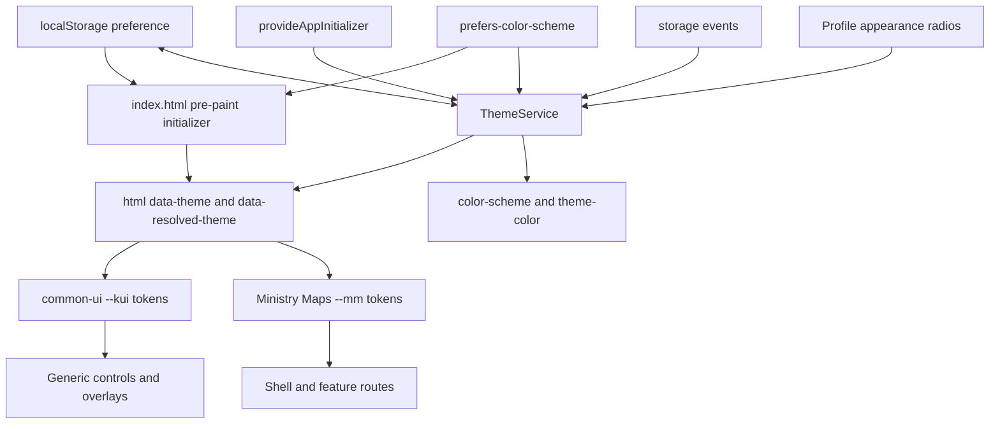

# Dark/light mode technical design

**Status: Ready for implementation**
**Scope: architecture for the later implementation; no production code is changed here**

Read [requirements.md](./requirements.md) first. This document owns the runtime architecture and file-level design. [assets/theme-token-contract.md](./assets/theme-token-contract.md) owns token names/values, and [implementation-runbook.md](./implementation-runbook.md) owns execution order.

## Architecture summary



There are two coordinated startup layers:

1. A tiny synchronous script in `apps/ministry-maps/src/index.html` resolves and applies the initial state before application CSS/content can paint.
2. A root `ThemeService`, initialized through Angular’s standalone `provideAppInitializer`, adopts the same contract and owns subsequent profile, media-query, and cross-tab changes.

CSS custom properties are the rendering mechanism. Angular does not walk components, toggle per-component classes, or maintain a separate overlay theme.

## Root state contract

The root `html` element always exposes both dimensions:

| Attribute             | Allowed values            | Meaning                                    |
| --------------------- | ------------------------- | ------------------------------------------ |
| `data-theme`          | `system`, `light`, `dark` | Persisted/in-memory preference.            |
| `data-resolved-theme` | `light`, `dark`           | Effective scheme after resolving `system`. |

Examples:

```html
<html data-theme="system" data-resolved-theme="dark">
  <html data-theme="light" data-resolved-theme="light"></html>
</html>
```

Do not replace `data-theme="system"` with the current resolved value. Diagnostics, CSS media behavior, unit/E2E tests, and live OS following depend on retaining both attributes.

## Runtime contracts

Add these files under `apps/ministry-maps/src/app/core/theme/`:

- `theme.types.ts`
- `theme.constants.ts`
- `browser-window.token.ts`
- `theme.service.ts`
- `theme.service.spec.ts`

### Types and constants

```ts
export type ThemePreference = 'system' | 'light' | 'dark';
export type ResolvedTheme = 'light' | 'dark';

export const THEME_STORAGE_KEY = 'ministry-maps.theme-preference';
export const DARK_MODE_QUERY = '(prefers-color-scheme: dark)';
export const THEME_ATTRIBUTE = 'data-theme';
export const RESOLVED_THEME_ATTRIBUTE = 'data-resolved-theme';
export const THEME_COLOR_META_SELECTOR = 'meta[name="theme-color"][data-mm-theme-color]';

export const THEME_META_COLORS: Readonly<Record<ResolvedTheme, string>> = {
  light: '#E7E6E4',
  dark: '#121212',
};
```

Export a type guard such as `isThemePreference(value: unknown): value is ThemePreference` from `theme.types.ts` or `theme.constants.ts`. Use it at every untrusted boundary, including initialization, storage events, and the public setter at runtime. Do not cast storage strings to the union.

The literal values above are contracts. The head initializer must mirror them because it runs before the Angular bundle; the drift test described below is mandatory.

### Browser injection token

`browser-window.token.ts` defines `BROWSER_WINDOW` as an `InjectionToken<Window | null>` whose factory returns `inject(DOCUMENT).defaultView`. This provides one injectable boundary for `localStorage`, `matchMedia`, window events, and test doubles.

- Do not read ambient `window` from components or scatter window checks throughout the feature.
- Treat a null `defaultView` as a supported degraded environment: preference `system`, resolved light, root attributes/metadata applied where the injected document permits it.
- Tests provide deterministic storage, media-query, and event doubles through this token.

### Service API

```ts
@Injectable({ providedIn: 'root' })
export class ThemeService {
  readonly preference: Signal<ThemePreference>;
  readonly resolvedTheme: Signal<ResolvedTheme>;

  initialize(): void;
  setPreference(preference: ThemePreference): void;
}
```

Implementation shape:

- Use `inject(DOCUMENT)`, `inject(BROWSER_WINDOW)`, and `inject(DestroyRef)`; do not add constructor injection.
- Back `preference` with a private writable signal initialized to `system`.
- Back current system darkness with a private writable signal initialized to `false`.
- Derive `resolvedTheme` with `computed`: explicit preferences resolve directly; `system` selects from current media state.
- Keep initialization idempotent with an internal boolean. Repeated `initialize()` calls must not reread into a reset loop or register duplicate listeners.
- Use one private application method to set both root attributes, root `style.colorScheme`, and the identified theme-color meta content from the current signals.
- Register exactly one media-query change listener and one window storage listener. Register cleanup once with `DestroyRef.onDestroy`.
- Do not persist while handling a `storage` event.

`setPreference()` performs this order synchronously:

1. Validate the runtime argument; reject invalid internal calls with an explicit programmer error rather than writing malformed state.
2. Update the in-memory preference.
3. Apply root attributes, resolved `color-scheme`, and metadata immediately.
4. Attempt `localStorage.setItem(THEME_STORAGE_KEY, preference)` inside `try/catch`.

A failed write must not roll back steps 2–3.

## Initialization flow

### Before first paint

In `apps/ministry-maps/src/index.html`:

1. Keep exactly one meta element identifiable with `name="theme-color"` and `data-mm-theme-color`, seeded to `#E7E6E4`.
2. Add `<meta name="color-scheme" content="light dark">` as browser capability metadata.
3. Place one inline initializer after those meta elements and before render-blocking application styles/scripts injected into the head.
4. Wrap all browser-dependent reads in defensive `try/catch` blocks; setting document attributes must still be attempted when storage/media access fails.

Pseudocode contract:

```text
preference = system
try stored = localStorage.getItem(ministry-maps.theme-preference)
if stored is system/light/dark, preference = stored

systemDark = false
try systemDark = matchMedia('(prefers-color-scheme: dark)').matches

resolved = preference == dark
  or (preference == system and systemDark)
  ? dark : light

set html data-theme = preference
set html data-resolved-theme = resolved
set html style.colorScheme = resolved
set identified theme-color meta content = resolved canvas color
```

Keep the script minimal: no framework import, JSON parsing, DOM readiness listener, class-list sweep, logging, animation, or network access. A CSP nonce is out of scope unless the application already introduces CSP during implementation.

### Angular ownership

Modify `apps/ministry-maps/src/app/app-config.ts` with the standalone API:

```ts
provideAppInitializer(() => inject(ThemeService).initialize());
```

Do not create an NgModule or use deprecated `APP_INITIALIZER` boilerplate. Initialization is synchronous; it does not block on authentication, profile data, Firestore, or routing.

On first `initialize()`:

1. Read and validate storage; missing/invalid/read-failing becomes `system`.
2. Create the media-query object when possible and capture its current `matches`; failure becomes non-dark.
3. Set service signals and apply the same root/metadata contract. An already-correct head state therefore remains visually unchanged.
4. Attach media and storage listeners.
5. Register listener cleanup through `DestroyRef`.

The service may observe that storage changed between the head script and Angular startup; applying the newer valid value is correct.

## Event behavior

### Operating-system changes

For each `MediaQueryList` change:

- Update the private system-dark signal regardless of explicit preference so a later switch to `system` uses current state.
- Reapply root/metadata only when needed; `resolvedTheme` changes only if preference is `system`.
- Explicit `light` and `dark` remain visually unchanged.

Use the modern `addEventListener('change', listener)` API supported by the target browsers. If repository browser support at implementation time requires `addListener`, add a narrowly tested compatibility branch rather than an untyped call.

### Cross-tab storage changes

For each `StorageEvent`:

- Ignore all keys except `ministry-maps.theme-preference`.
- Valid `newValue` becomes that preference.
- `null` (removal) or any malformed value becomes `system`.
- Update in-memory/root/metadata immediately.
- Do not call `setItem` or remove the key in response; this prevents write loops.

The tab that invokes `setPreference()` already updates itself synchronously; browsers do not emit a storage event back to the source tab.

## Failure matrix

| Boundary/failure              | Required result                                                                         |
| ----------------------------- | --------------------------------------------------------------------------------------- |
| Missing storage key           | Preference `system`; resolve from media query.                                          |
| Invalid stored value          | Treat as `system`; do not crash or propagate invalid state.                             |
| Storage getter throws         | Preference `system`; continue startup.                                                  |
| Storage setter throws         | Keep selected preference/effective scheme in memory; reload may lose it.                |
| `defaultView` unavailable     | Preference `system`, resolved light; set document state if possible.                    |
| `matchMedia` absent/throws    | Treat system as light; explicit preferences still work.                                 |
| Invalid/removed storage event | Switch to `system`; do not write back.                                                  |
| Theme-color meta missing      | Root theme still works; application method must not throw. Unit test the degraded path. |
| Repeated `initialize()`       | No duplicate listeners and no unexpected persistence write.                             |
| Service destruction           | Remove media and storage listeners exactly once.                                        |

No failure may block Angular bootstrap.

## CSS token architecture

### Ownership

Add:

- `libs/common-ui/src/lib/styles/base/_theme.scss` — generic `--kui-*` contracts only.
- `apps/ministry-maps/src/styles/_theme.scss` — `--mm-*` aliases and Ministry Maps domain/status contracts only.

Wire the generic file through `libs/common-ui/src/lib/styles/base/_index.scss` and the existing `libs/common-ui/src/lib/styles/index.scss` chain. Import the app theme from the actual app entry point `apps/ministry-maps/src/styles/main.scss` after generic foundations are available and before app component partials consume app tokens.

Rules:

- `common-ui` may reference only `--kui-*` values and generic concepts.
- Ministry Maps may consume `--kui-*` and define/consume `--mm-*` aliases.
- `common-ui` must never reference `--mm-*`, app models, route states, role enums, territory alerts, or work statuses.
- Keep primitive Sass and TypeScript palette exports for compatibility, but stop introducing them into modified rendered properties.
- Do not use Sass color functions on `var(...)`; use explicit hover/active/selected token contracts.

### Selector ordering

Both theme files use this order so a consumer without attributes remains light-compatible and `system` dark wins by cascade:

```scss
:root,
:root[data-theme='light'],
:root[data-theme='system'] {
  @include light-theme-tokens;
  color-scheme: light;
}

:root[data-theme='dark'] {
  @include dark-theme-tokens;
  color-scheme: dark;
}

@media (prefers-color-scheme: dark) {
  :root[data-theme='system'] {
    @include dark-theme-tokens;
    color-scheme: dark;
  }
}
```

Do not add `data-theme` selectors to individual component style sheets. Components consume semantic variables and inherit the active contract.

`data-resolved-theme` is for diagnostics/E2E and unavoidable runtime decisions, not a second token cascade. CSS should derive tokens from preference selectors/media behavior so it remains functional before Angular.

## Component migration design

### Generic UI

- Replace compiled surface/text/border/action values with approved `--kui-*` variables.
- Move runtime severity maps in Note/Toaster from palette values to semantic modifier classes whose Sass consumes feedback token families.
- Set inheritable icon defaults to `currentColor`; host controls own semantic `color`.
- Retain public color inputs only when compatibility or a data/third-party API genuinely requires them. Make retained defaults `currentColor` or an approved token and document the escape hatch.
- For `icon-button.component.ts`, migrate only that directly touched component from constructor injection to `inject()` and replace the literal hover custom property with a semantic CSS fallback.
- CDK overlay children inherit root variables because they are descendants of `body`; migrate their actual surfaces/backdrop instead of toggling overlay-container classes.

### Ministry Maps

- Shell/header uses `--mm-color-shell*` and inherited icon color.
- Page canvas/profile avatar use app aliases from the token contract.
- Territory alerts, work states, and user-role badges receive business-semantic token families; do not preserve palette names in selectors or token names.
- Replace inline/runtime icon presentation with semantic classes and `currentColor` where presentation is not data.
- Keep layout-only Tailwind utilities. Replace arbitrary/palette color utilities with semantic component classes/custom properties rather than introducing `dark:` pairs.
- Images/logos remain unchanged unless a route-specific contrast check records a defect and targeted treatment.

The exhaustive current owners and tests are listed in [style-migration-matrix.md](./style-migration-matrix.md). Route/state evidence is listed in [assets/route-component-matrix.md](./assets/route-component-matrix.md).

## Profile control design

Add a standalone component under:

- `apps/ministry-maps/src/app/features/profile/components/appearance-settings/appearance-settings.component.ts`
- `apps/ministry-maps/src/app/features/profile/components/appearance-settings/appearance-settings.component.html`
- `apps/ministry-maps/src/app/features/profile/components/appearance-settings/appearance-settings.component.scss`
- `apps/ministry-maps/src/app/features/profile/components/appearance-settings/appearance-settings.component.spec.ts`

The component:

- Uses `inject(ThemeService)` and reads the public preference signal.
- Renders one `fieldset`, one `legend` (`Aparência`), helper text, and three same-name native radios.
- Uses values `system`, `light`, `dark`, labels `Sistema`, `Claro`, `Escuro`, and the stable test IDs in `requirements.md`.
- Calls `setPreference()` once on native selection change; no form submission, save state, or toast.
- Does not fetch or mutate account/profile data.

Import it directly into standalone `ProfilePageComponent`. Place it after current identity/congregation content and before logout while preserving existing role/authorization behavior.

## Exact planned file changes

### Add

- The five `core/theme` files listed above.
- `libs/common-ui/src/lib/styles/base/_theme.scss`.
- `apps/ministry-maps/src/styles/_theme.scss`.
- The four appearance-settings files listed above.

### Bootstrap/foundation modifications

- `apps/ministry-maps/src/index.html`.
- `apps/ministry-maps/src/app/app-config.ts`.
- `apps/ministry-maps/src/styles/main.scss`.
- `libs/common-ui/src/lib/styles/base/_index.scss`.
- Generic base/component style files listed in the migration matrix.

### Profile modifications

- `apps/ministry-maps/src/app/features/profile/pages/profile-page/profile-page.component.ts`.
- `apps/ministry-maps/src/app/features/profile/pages/profile-page/profile-page.component.html`.
- `apps/ministry-maps/src/app/features/profile/pages/profile-page/profile-page.component.scss` only if spacing/local layout is required.
- `apps/ministry-maps/src/app/features/profile/pages/profile-page/profile-page.component.spec.ts`.

All other style/template/spec changes are explicitly enumerated in [style-migration-matrix.md](./style-migration-matrix.md), not hidden behind “update all components.” `apps/ministry-maps/src/app/app.component.scss` exists but is not currently referenced by the root component; do not move shell styling into it opportunistically. Migrate the actual current owners.

## Test seams

`ThemeService` tests inject a document and deterministic window double with:

- Configurable storage get/set failures and captured writes.
- A fake `MediaQueryList` with current `matches`, listener capture, emitted changes, and removal assertions.
- Captured window storage listener and emitted valid/invalid/removal events.
- An identifiable theme-color meta element or its deliberate absence.

Assert signals, exact root attributes, `style.colorScheme`, meta content, write/no-write behavior, listener counts, idempotency, and cleanup. Do not assert only internal methods and do not leak mutated process-global browser state between tests.

Add one test that reads or otherwise checks `apps/ministry-maps/src/index.html` against TypeScript constants where practical. If Jest configuration makes direct HTML loading inappropriate, enforce the mirrored key/allowed values/attributes/meta colors with focused E2E assertions before accepting Phase 2.

## Rejected alternatives

| Alternative                              | Why rejected                                                                                                                |
| ---------------------------------------- | --------------------------------------------------------------------------------------------------------------------------- |
| Firestore/user-model persistence         | Adds schema/backend/offline/auth timing work, delays signed-out first paint, and conflicts with device-local product scope. |
| App-level overrides of library internals | Couples Ministry Maps to private `common-ui` selectors and leaves other consumers without a coherent generic contract.      |
| Library owns all app tokens              | Leaks Ministry Maps statuses and business semantics into a reusable library.                                                |
| Tailwind-only `dark:` classes            | Duplicates state across templates and cannot consistently govern Sass components, overlays, runtime SVGs, or metadata.      |
| Sass-only theme branches                 | Compile-time variables cannot react to preference changes at runtime.                                                       |
| Angular-only post-bootstrap application  | Allows visible wrong-theme paint and inconsistent signed-out/loading states.                                                |
| Overlay-container theme class            | Creates a second synchronization mechanism when root custom properties already inherit through `body`.                      |
| Global animated theme transition         | Can flash intermediate colors, complicate validation, and violate the immediate/reduced-motion contract.                    |
| Boolean dark flag                        | Cannot represent the persistent `system` choice or diagnose preference separately from resolution.                          |

## Architecture completion gate

Do not proceed beyond runtime/token foundations until all are true:

- No-attribute roots retain the current light-compatible baseline.
- `data-theme="dark"` defines every token in [assets/theme-token-contract.md](./assets/theme-token-contract.md).
- Head and Angular paths agree on key, values, attributes, query, and metadata colors.
- Missing/blocked/malformed storage and media failures do not throw.
- Initialization and listener registration are idempotent and cleanup is covered.
- No generic style contains `--mm-*` or Ministry Maps concepts.
- Focused `common-ui` and Ministry Maps unit/lint gates for changed foundations pass.
